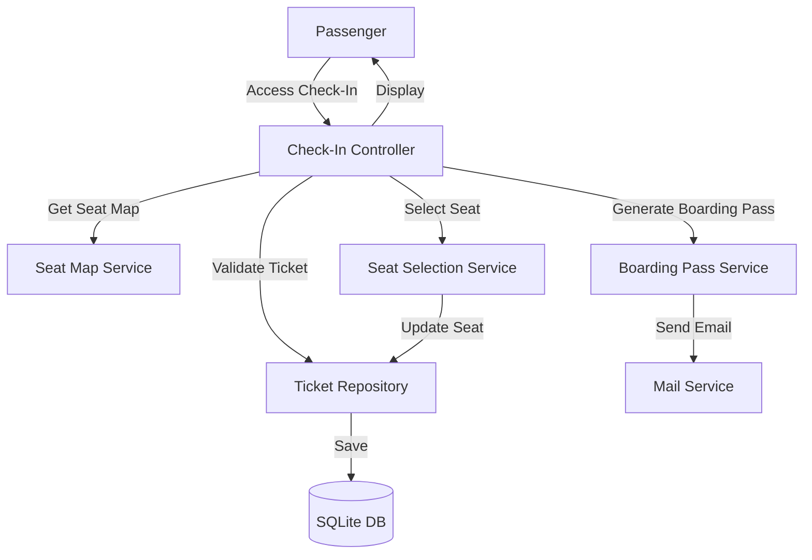

# System Design: Online Check-In Feature

## Architecture Overview
**What is the high-level system structure?**



**Key Components:**
- **Check-In Controller**: Handles check-in requests and orchestrates the process
- **Seat Map Service**: Generates seat map visualization and availability
- **Seat Selection Service**: Manages seat assignment and validation
- **Boarding Pass Service**: Generates boarding pass documents
- **Ticket Repository**: Extended with check-in status and seat management
- **Database**: Ticket table extended with check-in status and timestamp

**Technology Stack:**
- ASP.NET Core MVC (existing)
- Entity Framework Core (existing)
- SQLite (existing)
- PDF generation library (new - for boarding passes)
- Email service (existing - MailService)

## Data Models
**What data do we need to manage?**

### Ticket Model Changes
```csharp
public class Ticket
{
    // Existing properties...
    public bool IsCheckedIn { get; set; }  // New: Check-in status
    public DateTime? CheckInTime { get; set; }  // New: When check-in occurred
    public string? BoardingPassUrl { get; set; }  // New: URL/path to boarding pass PDF
    // ... rest of properties
}
```

### Seat Map ViewModel
```csharp
public class SeatMapViewModel
{
    public int TripId { get; set; }
    public SeatClass SeatClass { get; set; }
    public List<SeatInfo> Seats { get; set; } = new();
    public int TotalRows { get; set; }
    public int SeatsPerRow { get; set; }
    public int TotalSeats { get; set; }
    public int AvailableSeats { get; set; }
    public int BookedSeats { get; set; }
}

public class SeatInfo
{
    public string SeatNumber { get; set; } = string.Empty;  // Format: {Row}{Letter} (e.g., "12A")
    public bool IsAvailable { get; set; }
    public bool IsSelected { get; set; }  // Currently selected by user
    public int Row { get; set; }  // Row number (1-50)
    public int Column { get; set; }  // Column index (0-based)
    public string ColumnLetter { get; set; } = string.Empty;  // Letter (A-F)
    public SeatPosition Position { get; set; }  // Window, Middle, Aisle
}

public enum SeatPosition
{
    Window,
    Middle,
    Aisle
}
```

### Check-In ViewModel
```csharp
public class CheckInViewModel
{
    public Ticket Ticket { get; set; } = null!;
    public bool IsEligible { get; set; }
    public string? EligibilityMessage { get; set; }
    public DateTime? CheckInWindowStart { get; set; }  // 48 hours before departure
    public DateTime? CheckInWindowEnd { get; set; }  // 2 hours before departure
    public SeatMapViewModel? SeatMap { get; set; }
}
```

### Database Schema Changes
- Add `IsCheckedIn` column to `Tickets` table
  - Type: `BOOLEAN` (SQLite: `INTEGER`)
  - Default: `false`
  - Indexed for fast queries (`IX_Tickets_IsCheckedIn`)
- Add `CheckInTime` column to `Tickets` table
  - Type: `DATETIME` (SQLite: `TEXT`)
  - Nullable: `true`
  - Stores UTC timestamp of check-in
- Add `BoardingPassUrl` column to `Tickets` table
  - Type: `TEXT`
  - Nullable: `true`
  - Stores relative path to boarding pass PDF (e.g., `boarding-passes/ABC123/boarding-pass-ABC123-20241220120000.pdf`)
  - Path structure: `wwwroot/boarding-passes/{PNR}/{filename}.pdf`

### Data Flow
1. **Check-In Process**: 
   - User initiates check-in → Validate ticket eligibility → Display seat map → User selects seat → Update ticket → Generate boarding pass → Save boarding pass → Send email
2. **Seat Selection**:
   - User views seat map → System queries available seats → User selects seat → Validate availability → Update ticket seat → Confirm selection
3. **Boarding Pass Generation**:
   - After check-in → Generate PDF → Save to storage → Update ticket with URL → Send email with attachment

## API Design
**How do components communicate?**

### Authentication & Authorization Flow

#### Public Access (PNR Lookup)
1. User provides PNR code + Email
2. System validates PNR + Email match (same as PNR lookup)
3. If valid, allow check-in access
4. Session stores ticket ID for subsequent requests

#### Authenticated Access (Logged-in User)
1. User must be logged in
2. System validates user owns the ticket (UserId matches)
3. Allow check-in access
4. Can access multiple tickets for check-in

### Internal Interfaces

#### Seat Map Service Interface
```csharp
public interface ISeatMapService
{
    SeatMapViewModel GetSeatMap(int tripId, SeatClass seatClass);
    bool IsSeatAvailable(int tripId, string seatNumber);
    List<string> GetAvailableSeats(int tripId, SeatClass seatClass);
}
```

#### Seat Selection Service Interface
```csharp
public interface ISeatSelectionService
{
    Task<bool> AssignSeatAsync(int ticketId, string seatNumber);
    Task<bool> ChangeSeatAsync(int ticketId, string newSeatNumber);
    bool ValidateSeatAvailability(int tripId, string seatNumber, SeatClass seatClass);
}
```

#### Boarding Pass Service Interface
```csharp
public interface IBoardingPassService
{
    Task<string> GenerateBoardingPassAsync(Ticket ticket);
    Task SendBoardingPassEmailAsync(Ticket ticket, string boardingPassPath);
}
```

### Controller Endpoints

#### Check-In Controller (New)
- `GET /CheckIn/Index?pnr={pnr}&email={email}` - Display check-in form (public access via PNR)
  - Authentication: Validate PNR + Email (same as PNR lookup)
  - Returns: CheckInViewModel with eligibility status
- `GET /CheckIn/MyTickets` - Display user's tickets eligible for check-in (logged-in users)
  - Authentication: Requires logged-in user session
  - Returns: List of tickets with check-in eligibility
- `GET /CheckIn/SeatMap?ticketId={id}` - Display seat map for ticket
  - Authentication: Validate ticket ownership (PNR+Email or logged-in user)
  - Returns: SeatMapViewModel with available/occupied seats
- `POST /CheckIn/CheckIn` - Process check-in request
  - Input: TicketId, SelectedSeatNumber (optional - can be assigned during booking)
  - Authentication: Validate ticket ownership
  - Validation: Check eligibility (payment, window, not already checked in)
  - Output: Success/Error response with boarding pass URL
- `POST /CheckIn/SelectSeat` - Select/change seat during check-in
  - Input: TicketId, SeatNumber
  - Authentication: Validate ticket ownership
  - Validation: Check seat availability, prevent concurrent selection
  - Output: Success/Error response

### Request/Response Formats

#### Check-In Request
```json
{
  "ticketId": 123,
  "seatNumber": "12A"
}
```

#### Check-In Success Response
```json
{
  "success": true,
  "message": "Check-in successful",
  "boardingPassUrl": "/boarding-passes/ABC123/boarding-pass-ABC123-20241220120000.pdf",
  "checkInTime": "2024-12-20T12:00:00Z",
  "seatNumber": "12A"
}
```

#### Check-In Error Response
```json
{
  "success": false,
  "error": "Check-in window has closed",
  "errorCode": "CHECKIN_WINDOW_CLOSED",
  "details": "Check-in is only available 24-48 hours before departure"
}
```

#### Seat Map Response
```json
{
  "tripId": 456,
  "seatClass": "Economy",
  "totalRows": 30,
  "seatsPerRow": 6,
  "totalSeats": 180,
  "availableSeats": 150,
  "bookedSeats": 30,
  "seats": [
    {
      "seatNumber": "12A",
      "isAvailable": true,
      "isSelected": false,
      "row": 12,
      "column": 0,
      "columnLetter": "A",
      "position": "Window"
    }
  ]
}
```

#### Seat Selection Response
```json
{
  "success": true,
  "seatNumber": "12A",
  "message": "Seat assigned successfully"
}
```

#### Seat Selection Error Response
```json
{
  "success": false,
  "error": "Seat already taken",
  "errorCode": "SEAT_UNAVAILABLE",
  "suggestedSeats": ["12B", "12C", "13A"]
}
```

## Component Breakdown
**What are the major building blocks?**

### Backend Components

#### 1. Check-In Controller (`Controllers/CheckInController.cs`) - NEW
- Handle check-in requests
- Validate ticket eligibility
- Orchestrate check-in process
- Return check-in status and boarding pass

#### 2. Seat Map Service (`Services/SeatMapService.cs`) - NEW
- Generate seat map visualization
- Calculate available seats based on trip configuration
- Return seat map data structure

#### 3. Seat Selection Service (`Services/SeatSelectionService.cs`) - NEW
- Validate seat availability
- Assign seats to tickets
- Handle seat changes
- Prevent concurrent seat assignments

#### 4. Boarding Pass Service (`Services/BoardingPassService.cs`) - NEW
- Generate PDF boarding passes using QuestPDF library
- Include all required information:
  - Passenger name (full name from ticket)
  - Flight details (departure/arrival cities, plane name)
  - Departure date and time
  - Arrival time (calculated from departure + duration)
  - Seat number and class
  - Gate number (default: "A04" or configurable)
  - Boarding time (departure time - 45 minutes)
  - PNR code
  - Booking ID (formatted as #000123)
  - QR code (if available in ticket)
  - Airline/company name and logo
- Save boarding pass to storage:
  - Storage path: `wwwroot/boarding-passes/{PNR}/{filename}.pdf`
  - Filename format: `boarding-pass-{PNR}-{timestamp}.pdf`
  - Access: Secure endpoint validates ticket ownership before serving file
- Send email with boarding pass attachment via MailService
- Handle storage failures gracefully (log error, still complete check-in)

#### 5. Ticket Repository Extensions (`Repositories/TicketRepository.cs`)
- `Task<bool> IsEligibleForCheckInAsync(int ticketId)` - Check if ticket can be checked in
- `Task UpdateCheckInStatusAsync(int ticketId, bool isCheckedIn, DateTime checkInTime)` - Update check-in status
- `Task<List<Ticket>> GetEligibleTicketsForCheckInAsync(int userId)` - Get user's tickets eligible for check-in

### Frontend Components

#### 1. Check-In View (`Views/CheckIn/Index.cshtml`) - NEW
- Form for PNR/Email input (if public access)
- Display ticket information
- Show check-in eligibility status
- Link to seat selection

#### 2. Seat Map View (`Views/CheckIn/SeatMap.cshtml`) - NEW
- Interactive seat map visualization
- Available seats highlighted
- Occupied seats shown
- Seat selection interface

#### 3. Check-In Confirmation View (`Views/CheckIn/Confirmation.cshtml`) - NEW
- Display check-in success message
- Show boarding pass download link
- Display seat assignment
- Show boarding information

#### 4. My Tickets for Check-In View (`Views/CheckIn/MyTickets.cshtml`) - NEW
- List of user's tickets eligible for check-in
- Show check-in window (24-48 hours before departure)
- Link to check-in for each ticket

### Database Layer
- Migration: Add check-in related columns to Tickets table
- Indexes: 
  - Add index on `IsCheckedIn` for fast queries (`IX_Tickets_IsCheckedIn`)
  - Add composite index on `TripId` and `SeatNumber` for seat availability queries (`IX_Tickets_TripId_SeatNumber`)
  - Index on `CheckInTime` for reporting/analytics (optional)

## Design Decisions
**Why did we choose this approach?**

### Key Architectural Decisions

1. **Check-In Access Strategy**
   - **Decision**: Support both PNR lookup (public) and logged-in user access
   - **Rationale**: Flexibility for passengers who may not have accounts
   - **Alternative Considered**: Logged-in only (rejected - less user-friendly)

2. **Seat Map Generation**
   - **Decision**: Generate seat map dynamically from Trip configuration
   - **Rationale**: Flexible, works with different aircraft configurations
   - **Alternative Considered**: Static seat maps (rejected - not scalable)

3. **Boarding Pass Format**
   - **Decision**: PDF format with email delivery
   - **Rationale**: Standard format, easy to print, mobile-friendly
   - **Alternative Considered**: HTML only (rejected - less portable)

4. **Check-In Window Enforcement**
   - **Decision**: Server-side validation of check-in window (24-48 hours before departure, closes 2 hours before)
   - **Rationale**: Security, prevents manipulation, ensures compliance with airline regulations
   - **Implementation**: Calculate window based on departure time in UTC, validate on every check-in request
   - **Alternative Considered**: Client-side only (rejected - insecure, can be bypassed)

5. **Seat Selection Timing**
   - **Decision**: Allow seat selection during check-in only
   - **Rationale**: Simplifies process, ensures seat availability, reduces complexity
   - **Alternative Considered**: Separate seat selection (rejected - more complex, requires separate UI flow)
   
6. **Seat Numbering Convention**
   - **Decision**: Standard airline format {Row}{Letter} (e.g., 12A, 12B, 12C)
   - **Rationale**: Industry standard, familiar to passengers, easy to understand
   - **Format Details**: 
     - Rows: 1-50 (numeric)
     - Letters: A-F (depending on aircraft type, typically 6 seats per row for Economy)
     - Window seats: A and F (or last letter)
     - Aisle seats: C and D (middle letters)
   - **Alternative Considered**: Numeric only (rejected - less intuitive, doesn't indicate position)
   
7. **Boarding Pass Storage**
   - **Decision**: Local file system storage initially (`wwwroot/boarding-passes/`)
   - **Rationale**: Simple, no external dependencies, sufficient for MVP
   - **Future**: Can upgrade to cloud storage (Azure Blob, AWS S3) for scalability
   - **Security**: Files not publicly accessible, served via secure controller endpoint
   - **Alternative Considered**: Database storage (rejected - inefficient for PDF files)

### Patterns Applied
- **Service Pattern**: Separate services for seat map, seat selection, and boarding pass generation
- **Repository Pattern**: Extended existing repository for check-in operations
- **Dependency Injection**: Services injected via constructor

## Non-Functional Requirements
**How should the system perform?**

### Performance Targets
- Check-in process: < 30 seconds end-to-end
- Seat map loading: < 2 seconds
- Seat selection: < 1 second response time
- Boarding pass generation: < 3 seconds
- Database queries: < 100ms

### Scalability Considerations
- Seat map generation should be efficient (cached if possible)
- Concurrent seat selections handled via database transactions
- Boarding pass generation can be async/background job if needed

### Security Requirements
- **Authentication**: Validate ticket ownership via PNR + Email (public access) or logged-in user session
- **Authorization**: Ensure user can only check-in their own tickets
- **Duplicate Prevention**: Database constraint + application logic to prevent duplicate check-ins
- **Secure Storage**: Boarding pass files stored securely, accessed only via authenticated endpoint
- **Window Validation**: Server-side validation of check-in window (cannot be bypassed)
- **Concurrent Protection**: Database transactions + optimistic locking prevent seat hijacking
- **Input Validation**: Validate all inputs (ticket ID, seat number format, etc.)
- **SQL Injection**: Protected via EF Core parameterized queries
- **File Access**: Boarding pass download endpoint validates ticket ownership before serving file

### Reliability/Availability Needs
- Check-in process must be atomic (all-or-nothing)
- Seat selection must prevent race conditions
- System should handle concurrent check-ins gracefully
- Boarding pass generation failure should not block check-in

### Data Integrity
- Check-in status must be consistent
- Seat assignments must be unique per flight
- Check-in time must be recorded accurately
- Boarding pass URL must be valid and accessible

