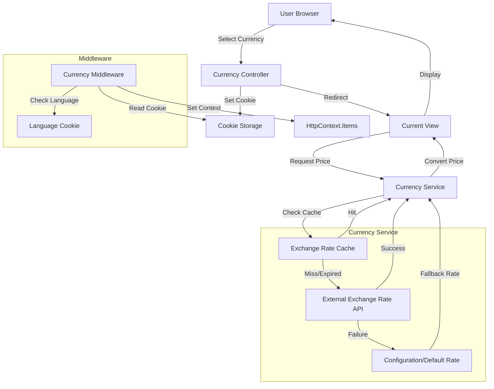

# System Design & Architecture

## Architecture Overview
**What is the high-level system structure?**



- Key components:
  - **CurrencyController**: Handles currency switching requests (follows LanguageController pattern)
  - **CurrencyService**: Manages exchange rate fetching, caching, and conversion
  - **Exchange Rate API**: External service providing real-time exchange rates (ExchangeRate-API recommended)
  - **Cache**: Stores exchange rates to reduce API calls (IMemoryCache initially)
  - **Cookie/Session**: Stores user currency preference
  - **Currency Middleware**: Sets currency context from cookie/session and language preference
  - **Configuration**: Stores default exchange rates and cache settings (appsettings.json)
  - **Currency Switcher Component**: Partial view for currency selection (similar to _LanguageSwitcher)
- Technology stack:
  - ASP.NET Core MVC (existing)
  - HttpClient for API calls
  - IMemoryCache for caching (upgradeable to IDistributedCache/Redis)
  - Cookie-based currency preference storage
  - Configuration API (IOptions pattern) for settings

## Data Models
**What data do we need to manage?**

- No new database entities required initially
- Currency preference stored in:
  - Cookie: `currency` cookie (e.g., "VND", "USD")
  - Session: Optional fallback if cookies disabled
- Exchange rate cache structure:
  - Key: "ExchangeRate_VND_USD" (or similar)
  - Value: Exchange rate (decimal)
  - Expiration: Configurable (e.g., 1 hour)
- Currency conversion model:
  ```csharp
  public class CurrencyConversion
  {
      public string FromCurrency { get; set; } // "USD"
      public string ToCurrency { get; set; }   // "VND"
      public decimal ExchangeRate { get; set; }
      public DateTime LastUpdated { get; set; }
      public DateTime ExpiresAt { get; set; }
      public bool IsFromCache { get; set; }    // Indicates if rate came from cache
      public bool IsFallback { get; set; }     // Indicates if using fallback/default rate
  }
  ```
- Price display model:
  ```csharp
  public class PriceDisplay
  {
      public decimal OriginalAmount { get; set; }      // USD (source)
      public string OriginalCurrency { get; set; }     // "USD"
      public decimal ConvertedAmount { get; set; }     // VND or USD (converted)
      public string Currency { get; set; }             // "VND" or "USD" (target)
      public decimal ExchangeRate { get; set; }
      public string FormattedString { get; set; }      // Formatted display (e.g., "₫1,500,000" or "$65")
      public bool IsApproximate { get; set; }          // True if using cached/fallback rate
  }
  ```
- Exchange rate API response model:
  ```csharp
  public class ExchangeRateApiResponse
  {
      public string Base { get; set; }                 // "USD"
      public DateTime Date { get; set; }
      public Dictionary<string, decimal> Rates { get; set; }  // {"VND": 24500.00, ...}
  }
  ```
- Currency configuration model:
  ```csharp
  public class CurrencyOptions
  {
      public string DefaultCurrency { get; set; }      // "USD"
      public decimal DefaultExchangeRate { get; set; }  // Fallback rate (e.g., 24500)
      public int CacheExpirationMinutes { get; set; }  // 60 (1 hour)
      public string ApiProvider { get; set; }          // "ExchangeRate-API"
      public string ApiEndpoint { get; set; }
      public string ApiKey { get; set; }              // Optional
  }
  ```

## API Design
**How do components communicate?**

- Currency switching endpoint:
  - Route: `/Currency/SetCurrency`
  - Method: GET or POST
  - Parameters: `currency` (string), `returnUrl` (string, optional)
  - Response: Redirect to returnUrl or referrer
  - Validation: Whitelist approach (only "VND" or "USD" accepted)
  - Security: Sanitize returnUrl to prevent open redirect attacks
- External Exchange Rate API:
  - Provider: **ExchangeRate-API** (recommended - free tier: 1,500 requests/month, no API key required)
  - Endpoint: `https://api.exchangerate-api.com/v4/latest/USD`
  - Alternative: Fixer.io, CurrencyAPI (if ExchangeRate-API unavailable)
  - Authentication: No API key required for ExchangeRate-API free tier
  - Response format: JSON with exchange rates
  - Example response:
    ```json
    {
      "base": "USD",
      "date": "2024-01-15",
      "rates": {
        "VND": 24500.00,
        "EUR": 0.92,
        ...
      }
    }
    ```
- Internal Currency Service interface:
  ```csharp
  public interface ICurrencyService
  {
      // Get exchange rate (from cache, API, or fallback)
      Task<decimal> GetExchangeRateAsync(string fromCurrency, string toCurrency);
      
      // Get exchange rate with metadata (cache status, fallback info)
      Task<CurrencyConversion> GetExchangeRateInfoAsync(string fromCurrency, string toCurrency);
      
      // Convert amount between currencies
      Task<decimal> ConvertAmountAsync(decimal amount, string fromCurrency, string toCurrency);
      
      // Format price for display (with currency symbol, rounding)
      Task<PriceDisplay> FormatPriceAsync(decimal usdAmount, string targetCurrency);
      
      // Get current user's selected currency
      string GetCurrentCurrency();
      
      // Check if currency is supported
      bool IsCurrencySupported(string currency);
      
      // Refresh exchange rate (force API call, update cache)
      Task RefreshExchangeRateAsync(string fromCurrency, string toCurrency);
  }
  ```

## Component Breakdown
**What are the major building blocks?**

- **CurrencyController**:
  - `SetCurrency(string currency, string returnUrl)` action
  - Follows LanguageController pattern for consistency
  - Sets cookie with currency preference (1 year expiration, SameSite=Lax)
  - Validates currency parameter (whitelist: "VND", "USD")
  - Sanitizes returnUrl to prevent open redirect attacks
  - Redirects to returnUrl, referrer, or default page
- **CurrencyService** (new service):
  - `GetExchangeRateAsync()`: Fetches exchange rate from API or cache
  - `GetExchangeRateInfoAsync()`: Returns rate with metadata (cache status, fallback)
  - `ConvertAmountAsync()`: Converts amount between currencies with proper rounding
  - `FormatPriceAsync()`: Formats price for display (VND: no decimals, USD: 2 decimals)
  - `GetCurrentCurrency()`: Gets user's selected currency from HttpContext
  - `IsCurrencySupported()`: Validates currency code
  - `RefreshExchangeRateAsync()`: Forces API call and cache update
  - Handles API failures with fallback to cached/default rates
  - Manages cache expiration (1 hour) and refresh logic
  - Logs API failures, cache hits/misses, fallback usage
- **Currency Middleware**:
  - Reads currency from cookie (`currency` cookie)
  - Checks language preference to determine default currency:
    - If language is Vietnamese → default to VND
    - Otherwise → default to USD
  - Sets currency context in `HttpContext.Items["CurrentCurrency"]`
  - Falls back to default if cookie not set
  - Runs early in pipeline (after localization middleware)
- **Exchange Rate API Client**:
  - HttpClient wrapper for external API (ExchangeRate-API)
  - Handles authentication (if API key required in future)
  - Parses API response (ExchangeRateApiResponse model)
  - Error handling with retry logic (max 2 retries)
  - Timeout handling (5 seconds default)
  - Rate limiting prevention (uses cache to avoid spam)
- **Configuration Service**:
  - Reads `CurrencyOptions` from appsettings.json
  - Provides default exchange rate for fallback
  - Configures cache expiration (default: 60 minutes)
  - Stores API endpoint and credentials
  - Uses IOptions pattern for dependency injection
- **Currency Switcher Component**:
  - Partial view `_CurrencySwitcher.cshtml` (similar to `_LanguageSwitcher.cshtml`)
  - Displays current currency (VND/USD) with toggle buttons
  - Includes in `_Layout.cshtml` for global access
  - Styled consistently with language switcher
- **View Helpers/Extensions**:
  - `@Html.DisplayPrice(decimal amount)` helper
  - Injects ICurrencyService via ViewBag or service locator
  - Extension methods for price formatting
  - Currency symbol display (₫ for VND, $ for USD)
  - Disclaimer text helper (shows "Approximate price, payment in USD")
  - Exchange rate info tooltip (optional: "1 USD = 24,500 VND")
- **JavaScript Integration**:
  - Update `updatePrice()` function in BookTrip.cshtml
  - Use currency-aware formatting (Intl.NumberFormat with selected currency)
  - Handle currency switching without page reload (AJAX update)

## Design Decisions
**Why did we choose this approach?**

- **External Exchange Rate API (ExchangeRate-API)**: 
  - Provides real-time, accurate rates without maintaining our own rate database
  - Free tier sufficient (1,500 requests/month) with hourly caching
  - No API key required initially, easy to integrate
  - Reliable and well-documented
- **Caching Strategy (Hourly Refresh)**:
  - Reduces API calls (24 calls/day vs 1,500+ without cache)
  - Improves performance (<50ms with cache vs <500ms API call)
  - Handles API failures gracefully (use cached rate)
  - Balance between accuracy and API rate limits
- **Cookie-based storage**: 
  - Simple, works without database changes
  - Persists across sessions (similar to language preference)
  - Follows existing pattern (LanguageController)
  - Can upgrade to database storage later if needed
- **Default Currency Logic**:
  - USD for all users initially (simple)
  - Or VND if user's language is Vietnamese (better UX for Vietnamese users)
  - Configurable via CurrencyOptions
- **Service layer pattern**: 
  - Separates currency logic from controllers
  - Makes testing easier (mock ICurrencyService)
  - Allows reuse across views, controllers, services
- **Display-only conversion**: 
  - Payment processing remains in USD to avoid complexity and compliance issues
  - Clear disclaimer that prices are approximate
  - Actual payment always in USD
- **Price Rounding Strategy**:
  - VND: No decimals (e.g., ₫1,500,000)
  - USD: 2 decimals (e.g., $65.00)
  - Matches local currency conventions
- **Cache Implementation (IMemoryCache)**:
  - Simple, built-in, no external dependencies
  - Sufficient for single-server deployment
  - Can upgrade to IDistributedCache (Redis) for multi-server later
- **Middleware Approach**:
  - Centralized currency context setting
  - Works for all requests automatically
  - Integrates with existing localization middleware
- Alternatives considered:
  - **Database-stored exchange rates**: Requires manual updates, less accurate, more maintenance
  - **Hardcoded exchange rate**: Simple but inaccurate, requires frequent code updates
  - **Multiple currency payment processing**: Too complex, compliance issues, out of scope
  - **URL-based currency**: Requires route changes, more complex routing (like /vi/ or /en/)
  - **JavaScript-only conversion**: Doesn't persist, requires page reload anyway

## Non-Functional Requirements
**How should the system perform?**

- Performance targets:
  - Currency conversion: <200ms (first time, API call), <50ms (with cache)
  - Exchange rate API call: <500ms (with 5 second timeout)
  - Currency switch: <100ms response time
  - Cache hit rate: >95% (with hourly refresh)
  - No noticeable performance impact on page loads
- Accuracy requirements:
  - Exchange rates accurate to at least 2 decimal places (calculation)
  - Display rounded appropriately (VND: no decimals, USD: 2 decimals)
  - Currency conversion calculations mathematically correct (no rounding errors)
- Scalability considerations:
  - Cache exchange rates to minimize API calls (24 calls/day with hourly refresh)
  - Rate limiting for API calls (prevent rapid switching from spamming API)
  - Cache can be in-memory (IMemoryCache) initially, upgrade to distributed (Redis) for multi-server deployments
  - Consider background job for periodic cache refresh (optional enhancement)
- Security requirements:
  - Validate currency parameter (whitelist: "VND", "USD") to prevent injection
  - Sanitize returnUrl to prevent open redirect attacks (Url.IsLocalUrl check)
  - Secure API key storage in appsettings.json (if required in future)
  - Rate limit API calls to prevent abuse (use cache, prevent rapid switching)
  - Secure cookie settings (SameSite=Lax, HttpOnly if needed)
- Reliability/availability needs:
  - Fallback to cached rate if API unavailable (even if expired)
  - Fallback to default rate from configuration if cache expired and API fails
  - Graceful degradation if currency service unavailable (show USD prices)
  - Log API failures, cache hits/misses, fallback usage for monitoring
  - Retry logic for API calls (max 2 retries with exponential backoff)
  - Health check endpoint for currency service (optional)
- Monitoring and observability:
  - Log exchange rate API calls (success/failure)
  - Log cache hits and misses
  - Log fallback usage (when default rate used)
  - Track currency preference distribution (analytics)
  - Alert on API failures or high fallback usage

## Integration Points
**How does this integrate with existing codebase?**

- **LanguageController Pattern**: 
  - CurrencyController follows same pattern as LanguageController
  - Same cookie management approach (1 year expiration, SameSite=Lax)
  - Same redirect logic (returnUrl validation, referrer fallback)
  - Consistent code structure for maintainability
- **Localization Infrastructure**:
  - Currency preference can be integrated with language preference
  - Default currency can be determined from language (VND if Vietnamese, USD otherwise)
  - Currency switcher can be placed near language switcher in layout
  - Can reuse existing cookie/session management patterns
- **View Updates Strategy**:
  - Replace hardcoded `$@price.ToString("N0")` with `@Html.DisplayPrice(price)`
  - Update all views that display prices:
    - User/Index.cshtml (flight search results)
    - User/BookTrip.cshtml (booking page)
    - User/MyBooking.cshtml (booking list)
    - Admin/Index.cshtml (revenue dashboard)
    - Partner/Index.cshtml (earnings dashboard)
    - Partner/TripsManagement.cshtml (trip prices)
  - Update JavaScript price formatting in BookTrip.cshtml
- **Existing Price Models**:
  - No changes to database models (Trip, Booking, etc.)
  - Prices remain stored in USD in database
  - Conversion happens at display time only
  - No migration required for existing data

## View Migration Strategy
**How to update views to use currency conversion?**

1. **Create View Helper**:
   - Add `@Html.DisplayPrice(decimal amount)` extension method
   - Helper injects ICurrencyService and formats price
   - Returns formatted string with currency symbol
   - Handles rounding (VND: no decimals, USD: 2 decimals)

2. **Update Views**:
   - Find all instances of `$@Model.Price.ToString("N0")`
   - Replace with `@Html.DisplayPrice(Model.Price)`
   - Update JavaScript `updatePrice()` function to use currency-aware formatting
   - Use `Intl.NumberFormat` with selected currency code

3. **Add Disclaimer**:
   - Add small text near prices: "Prices shown are approximate. Payment will be processed in USD."
   - Can be localized using existing localization infrastructure
   - Place in footer or near price displays

4. **Add Currency Switcher**:
   - Create `_CurrencySwitcher.cshtml` partial view
   - Include in `_Layout.cshtml` near language switcher
   - Style consistently with existing UI (follow _LanguageSwitcher pattern)
   - Use same color scheme and layout

