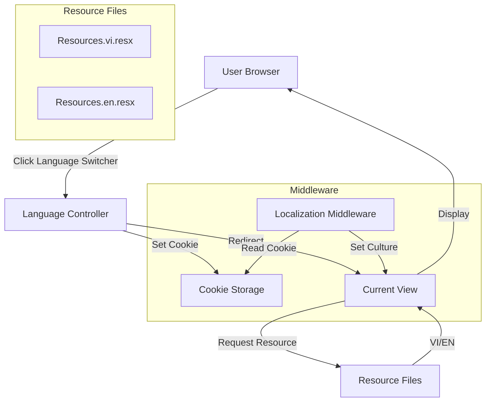

# System Design & Architecture

## Architecture Overview
**What is the high-level system structure?**



- Key components:
  - **LanguageController**: Handles language switching requests
  - **Resource Files**: Store translations (Resources.vi.resx, Resources.en.resx)
  - **Localization Middleware**: Sets culture from cookie/session
  - **Cookie/Session**: Stores user language preference
- Technology stack:
  - ASP.NET Core Localization (built-in)
  - IStringLocalizer for view localization
  - Cookie-based culture storage

## Data Models
**What data do we need to manage?**

- No new database entities required
- Language preference stored in:
  - Cookie: `culture` cookie (e.g., "vi-VN", "en-US")
  - Session: Optional fallback if cookies disabled
- Resource file structure:
  ```
  Resources/
    Resources.resx (default/neutral)
    Resources.vi.resx (Vietnamese)
    Resources.en.resx (English)
  ```

## API Design
**How do components communicate?**

- Language switching endpoint:
  - Route: `/Language/SetLanguage`
  - Method: GET or POST
  - Parameters: `culture` (string), `returnUrl` (string, optional)
  - Response: Redirect to returnUrl or referrer
- No external APIs required

## Component Breakdown
**What are the major building blocks?**

- **LanguageController**:
  - `SetLanguage(string culture, string returnUrl)` action
  - Sets cookie with culture preference
  - Redirects to returnUrl or referrer
- **Localization Middleware** (in Program.cs):
  - Reads culture from cookie
  - Sets Thread.CurrentCulture and Thread.CurrentUICulture
  - Configures RequestLocalizationOptions
- **Resource Files**:
  - Resources.resx (default)
  - Resources.vi.resx (Vietnamese translations)
  - Resources.en.resx (English translations)
- **Language Switcher Component**:
  - Partial view or component in _Layout.cshtml
  - Displays current language and allows switching
- **View Updates**:
  - Replace hardcoded strings with `@Localizer["Key"]`
  - Update all views to use localization

## Design Decisions
**Why did we choose this approach?**

- **ASP.NET Core Localization**: Built-in, well-tested, no external dependencies
- **Cookie-based storage**: Simple, works without database changes, persists across sessions
- **Resource files**: Standard .NET approach, easy to maintain, supports future languages
- **Middleware approach**: Centralized culture setting, works for all requests
- Alternatives considered:
  - Database storage: More complex, requires user authentication
  - URL-based culture: Requires route changes, more complex routing
  - JavaScript-only: Doesn't persist, requires page reload anyway

## Non-Functional Requirements
**How should the system perform?**

- Performance targets:
  - Language switch: <100ms response time
  - No noticeable performance impact on page loads
- Scalability considerations:
  - Resource files are compiled, minimal runtime overhead
  - Cookie storage has no scalability concerns
- Security requirements:
  - Validate culture parameter to prevent injection
  - Sanitize returnUrl to prevent open redirect attacks
- Reliability/availability needs:
  - Fallback to default language if resource missing
  - Graceful degradation if cookie disabled


