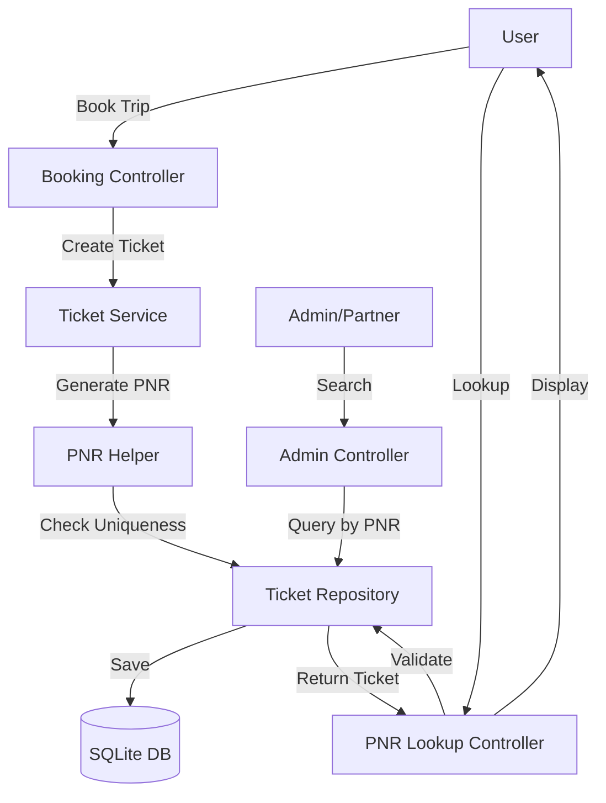

# System Design: PNR Booking Code Feature

## Architecture Overview
**What is the high-level system structure?**



**Key Components:**
- **PNR Helper**: Utility class for generating unique PNR codes
- **Ticket Model**: Extended with PNR property
- **PNR Lookup Controller**: New controller for public PNR lookup
- **Ticket Repository**: Extended with PNR lookup methods
- **Database**: Ticket table with PNR column and unique index

**Technology Stack:**
- ASP.NET Core MVC (existing)
- Entity Framework Core (existing)
- SQLite (existing)
- C# string manipulation for PNR generation

## Data Models
**What data do we need to manage?**

### Ticket Model Changes
```csharp
public class Ticket
{
    // Existing properties...
    public string? PNR { get; set; }  // New: 6-character alphanumeric code
    // ... rest of properties
}
```

### Database Schema Changes
- Add `PNR` column to `Tickets` table
  - Type: `TEXT` (SQLite) / `VARCHAR(6)` 
  - Nullable: `true` (for backward compatibility with existing tickets)
  - Unique Index: `IX_Tickets_PNR` 
    - Created via: `entity.HasIndex(e => e.PNR).IsUnique().HasFilter("[PNR] IS NOT NULL")`
    - Enforces uniqueness at database level
    - Filter allows multiple NULL values (backward compatibility)
    - Indexed for fast lookup queries (< 50ms)

### Data Flow
1. **Ticket Creation**: 
   - User books ticket → Ticket created → PNR generated → Saved to database
2. **PNR Lookup**:
   - User enters PNR + Email → Query database → Return ticket details
3. **PNR Display**:
   - Ticket retrieved → PNR displayed in views/emails

## API Design
**How do components communicate?**

### Internal Interfaces

#### PNR Helper Interface
```csharp
public interface IPNRHelper
{
    string GeneratePNR();
    Task<string> GenerateUniquePNRAsync(ITicketRepository repository);
    bool IsValidPNRFormat(string pnr);
}
```

#### Ticket Repository Extensions
```csharp
// New methods in TicketRepository
Task<Ticket?> GetByPNRAsync(string pnr);
Task<Ticket?> GetByPNRAndEmailAsync(string pnr, string email);
Task<bool> PNRExistsAsync(string pnr);
```

### Controller Endpoints

#### Public PNR Lookup (New Controller)
- `GET /PNR/Lookup` - Display lookup form
- `POST /PNR/Lookup` - Process lookup request
  - Input: PNR (string), Email (string)
  - Output: Ticket details view or error message

#### Admin/Partner Endpoints (Extended)
- `GET /Admin/Tickets?pnr={pnr}` - Search tickets by PNR
- `GET /Partner/Tickets?pnr={pnr}` - Search partner tickets by PNR

### Request/Response Formats
- **PNR Lookup Request**: Form data (PNR, Email)
- **PNR Lookup Response**: View with ticket details or error message
- **API Response** (if needed): JSON with ticket information

## Component Breakdown
**What are the major building blocks?**

### Backend Components

#### 1. PNR Helper (`Helpers/PNRHelper.cs`)
- **Responsibility**: Generate unique PNR codes with collision prevention
- **Methods**:
  - `GeneratePNR()`: Generate random 6-character code (no uniqueness check)
  - `GenerateUniquePNRAsync(ITicketRepository repository)`: Generate and verify uniqueness
    - Algorithm:
      1. Generate random PNR using `GeneratePNR()`
      2. Check if exists via `repository.PNRExistsAsync(pnr)`
      3. If exists, retry (max 5 attempts)
      4. If all retries fail, throw exception
      5. Return unique PNR
  - `IsValidPNRFormat(string pnr)`: Validate PNR format
- **Algorithm Details**: 
  - Character set: "ABCDEFGHJKMNPQRSTUVWXYZ23456789" (32 chars, excludes 0, O, 1, I, L)
  - Length: 6 characters
  - Random generation using `Random` class
  - Uniqueness guaranteed by:
    - Pre-check before assignment (application layer)
    - Database unique constraint (database layer)
    - Retry mechanism (collision handling)

#### 2. Ticket Model Update (`Models/DomainModels/Ticket.cs`)
- Add `PNR` property (nullable string, max 6 characters)

#### 3. Ticket Repository Extensions (`Repositories/TicketRepository.cs`)
- **PNR Existence Check**:
  - `Task<bool> PNRExistsAsync(string pnr)`: Check if PNR exists (case-insensitive)
    - Uses indexed query for performance
    - Normalizes to uppercase for comparison
    - Returns true if PNR exists, false otherwise
- **PNR Lookup Methods**:
  - `Task<Ticket?> GetByPNRAsync(string pnr)`: Get ticket by PNR (case-insensitive)
  - `Task<Ticket?> GetByPNRAndEmailAsync(string pnr, string email)`: Get ticket by PNR + Email
    - Validates both PNR and email match
    - Case-insensitive comparison for both fields

#### 4. PNR Controller (`Controllers/PNRController.cs`) - NEW
- Handle public PNR lookup requests
- Validate email + PNR combination
- Return ticket details view

#### 5. Booking Flow Updates (`Controllers/UserController.cs`)
- **PNR Generation in Booking Flow**:
  1. Inject `IPNRHelper` via constructor
  2. Before creating ticket, call `GenerateUniquePNRAsync()`
  3. Assign returned PNR to ticket entity
  4. Save ticket in database transaction
  5. If save fails due to unique constraint violation (extremely rare):
     - Catch `DbUpdateException`
     - Retry with new PNR generation
     - Log collision for monitoring
- **Error Handling**:
  - If PNR generation fails after retries, show user-friendly error
  - Log error for investigation
  - Booking transaction rolls back if PNR cannot be assigned

### Frontend Components

#### 1. PNR Lookup View (`Views/PNR/Lookup.cshtml`) - NEW
- Form for PNR + Email input
- Display ticket details after lookup
- Error handling UI

#### 2. Ticket Detail Views Updates
- `Views/User/Ticket.cshtml`: Display PNR code
- `Views/User/MyBooking.cshtml`: Show PNR in booking list
- `Views/Admin/...`: Show PNR in admin views

#### 3. Email Templates Updates
- Include PNR code in booking confirmation emails

### Database Layer
- Migration: Add PNR column to Tickets table
- Index: Create unique index on PNR (case-insensitive)
- Seed: Optional migration script for existing tickets

## Design Decisions
**Why did we choose this approach?**

### Key Architectural Decisions

1. **PNR Generation Strategy**
   - **Decision**: Server-side generation with uniqueness check
   - **Rationale**: Ensures uniqueness, prevents collisions, secure
   - **Alternative Considered**: Client-side generation (rejected - security risk)

2. **PNR Format**
   - **Decision**: 6 alphanumeric characters, excluding confusing chars
   - **Rationale**: Industry standard, human-readable, sufficient uniqueness
   - **Alternative Considered**: 8 characters (rejected - unnecessary complexity)

3. **PNR Lookup Security**
   - **Decision**: Require email + PNR combination
   - **Rationale**: Prevents unauthorized access, balances security and usability
   - **Alternative Considered**: PNR only (rejected - security risk)

4. **Backward Compatibility**
   - **Decision**: PNR column nullable, existing tickets can have null PNR
   - **Rationale**: No breaking changes, gradual migration possible
   - **Alternative Considered**: Require PNR for all tickets (rejected - breaks existing data)

5. **Case-Insensitive Lookup**
   - **Decision**: Store uppercase, compare case-insensitively
   - **Rationale**: Better user experience, standard practice
   - **Alternative Considered**: Case-sensitive (rejected - user confusion)

### Patterns Applied
- **Repository Pattern**: Existing pattern extended for PNR operations
- **Helper/Utility Pattern**: PNR generation logic separated into helper
- **Dependency Injection**: PNR helper injected where needed

## Non-Functional Requirements
**How should the system perform?**

### Performance Targets
- PNR generation: < 10ms per ticket
- PNR lookup: < 200ms (including database query)
- Uniqueness check: < 50ms
- Database index ensures fast PNR queries

### Scalability Considerations
- PNR uniqueness check uses indexed database query (scalable)
- Random generation with retry mechanism handles collisions
- Database index supports efficient lookups as data grows

### Security Requirements
- PNR codes are not predictable (random generation)
- PNR lookup requires email validation
- PNR codes should not be logged in plain text in error messages
- SQL injection protection via parameterized queries (EF Core)

### Reliability/Availability Needs
- PNR generation must handle collisions gracefully (retry mechanism)
- System should continue working if PNR generation fails (fallback)
- Database constraints ensure data integrity

### Data Integrity
- **Multi-layer Uniqueness Protection**:
  1. **Application Layer**: PNR Helper checks uniqueness before assignment via `PNRExistsAsync()`
  2. **Database Layer**: Unique index constraint (`IX_Tickets_PNR`) enforces uniqueness at DB level
  3. **Retry Mechanism**: If collision occurs, retry up to 5 times with new random PNR
  4. **Transaction Safety**: PNR generation and ticket creation in same transaction prevents race conditions
- Case-insensitive comparison ensures no case-based duplicates
- Nullable PNR allows backward compatibility

### PNR Uniqueness Guarantee Strategy

**How we ensure PNR codes never duplicate:**

1. **Pre-generation Check (Application Layer)**
   - Before assigning PNR, check if it exists using `PNRExistsAsync()`
   - Database index makes this check fast (< 50ms)
   - If exists, generate new PNR and retry

2. **Database Constraint (Database Layer)**
   - Unique index on PNR column: `HasIndex(e => e.PNR).IsUnique()`
   - SQLite enforces uniqueness constraint
   - Prevents duplicates even if application logic fails
   - Handles concurrent booking attempts

3. **Retry Mechanism**
   - If collision detected, retry with new random PNR
   - Maximum 5 retries before throwing exception
   - Probability of 5 consecutive collisions: ~0.0000001% (extremely rare)

4. **Case Normalization**
   - Store PNR in uppercase format
   - Compare case-insensitively in queries
   - Prevents "ABC123" vs "abc123" duplicates

5. **Transaction Isolation**
   - PNR generation and ticket save in same database transaction
   - Prevents race conditions in concurrent scenarios
   - Database lock ensures atomicity

**Collision Probability Analysis:**
- Character set: 32 characters (A-Z excluding confusing, 2-9)
- Possible combinations: 32^6 = 1,073,741,824
- With 1 million tickets: Collision probability ≈ 0.0005%
- With retry mechanism (5 attempts): Effective collision probability ≈ 0.0000000001%

