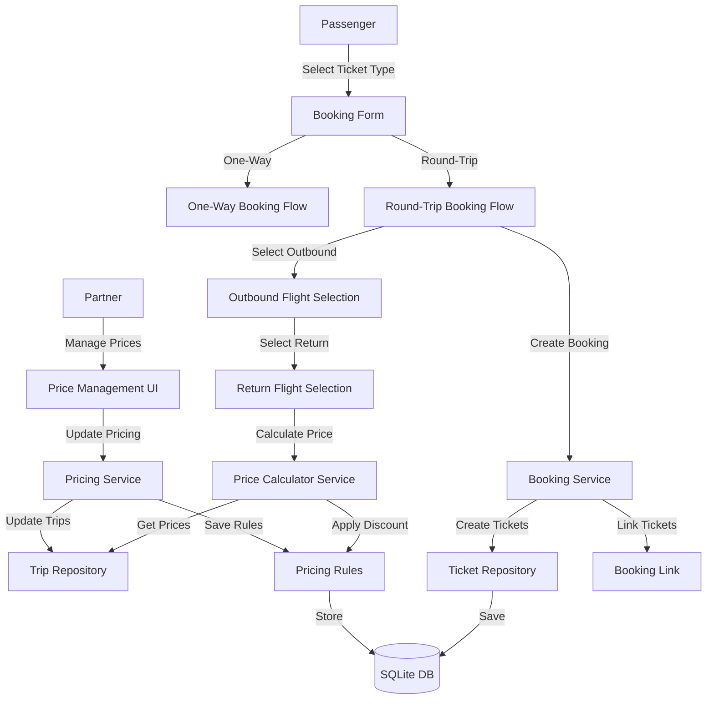

# System Design: Round-Trip Booking & Price Management

## Architecture Overview
**What is the high-level system structure?**



**Key Components:**
- **Booking Form**: Enhanced with ticket type selection (One-Way/Round-Trip)
- **Price Calculator Service**: Calculates round-trip prices with discounts
- **Pricing Service**: Manages pricing rules and discount percentages
- **Booking Service**: Creates linked bookings for round-trip tickets
- **Price Management UI**: Partner interface for managing pricing
- **Database**: Extended with pricing rules and booking links

**Technology Stack:**
- ASP.NET Core MVC (existing)
- Entity Framework Core (existing)
- SQLite (existing)
- No new external dependencies

## Data Models
**What data do we need to manage?**

### Trip Model Changes
```csharp
public class Trip
{
    // Existing properties...
    
    // New pricing fields
    public decimal RoundTripDiscountPercent { get; set; }  // Discount percentage for round-trip (0-50)
    public DateTime? PriceLastUpdated { get; set; }  // When pricing was last modified
}
```

### Ticket Model Changes
```csharp
public class Ticket
{
    // Existing properties...
    
    // New fields for round-trip linking
    public TicketType Type { get; set; }  // OneWay or RoundTrip
    public int? OutboundTicketId { get; set; }  // For return ticket: link to outbound
    public int? ReturnTicketId { get; set; }  // For outbound ticket: link to return
    public int? BookingGroupId { get; set; }  // Groups tickets in same round-trip booking
    
    // Navigation
    public Ticket? OutboundTicket { get; set; }
    public Ticket? ReturnTicket { get; set; }
}
```

### New Enum: TicketType
```csharp
public enum TicketType
{
    OneWay,
    RoundTrip
}
```

### New Model: PricingRule (Optional - for future enhancement)
```csharp
public class PricingRule
{
    public int Id { get; set; }
    public int CompanyId { get; set; }
    public string? FromCity { get; set; }  // Null = applies to all routes
    public string? ToCity { get; set; }  // Null = applies to all routes
    public decimal RoundTripDiscountPercent { get; set; }
    public DateTime EffectiveFrom { get; set; }
    public DateTime? EffectiveTo { get; set; }
    public bool IsActive { get; set; }
    public DateTime CreatedAt { get; set; }
    
    public Company Company { get; set; } = null!;
}
```

### Booking ViewModel (Enhanced)
```csharp
public class BookingViewModel
{
    public TicketType TicketType { get; set; }
    public Trip? OutboundTrip { get; set; }
    public Trip? ReturnTrip { get; set; }
    public SeatClass SeatClass { get; set; }
    
    // Pricing breakdown
    public decimal OutboundPrice { get; set; }
    public decimal ReturnPrice { get; set; }
    public decimal DiscountAmount { get; set; }
    public decimal TotalPrice { get; set; }
    public decimal SavingsAmount { get; set; }  // Compared to two one-way tickets
}
```

### Database Schema Changes
- Add `Type` column to `Tickets` table
  - Type: `INTEGER` (enum as int)
  - Default: `0` (OneWay)
  - Indexed for queries
- Add `OutboundTicketId` column to `Tickets` table
  - Type: `INTEGER`
  - Nullable: `true`
  - Foreign key to `Tickets.Id`
- Add `ReturnTicketId` column to `Tickets` table
  - Type: `INTEGER`
  - Nullable: `true`
  - Foreign key to `Tickets.Id`
- Add `BookingGroupId` column to `Tickets` table
  - Type: `INTEGER`
  - Nullable: `true`
  - Groups tickets in same booking
- Add `RoundTripDiscountPercent` column to `Trips` table
  - Type: `DECIMAL(5,2)`
  - Default: `0`
  - Range: 0-50
- Add `PriceLastUpdated` column to `Trips` table
  - Type: `DATETIME`
  - Nullable: `true`

### Data Flow
1. **Round-Trip Booking Process:**
   - User selects Round-Trip → Select outbound flight → Select return flight → 
   - Price Calculator: Get outbound price + return price → Apply discount → Calculate total →
   - Booking Service: Create booking group → Create outbound ticket → Create return ticket → Link tickets → Return confirmation

2. **Price Management Process:**
   - Partner sets discount percentage → Pricing Service validates → Update Trip records → 
   - Invalidate price cache (if exists) → New bookings use updated prices

3. **Price Calculation:**
   - Get base prices for outbound and return trips → Calculate total → 
   - Apply discount percentage → Calculate savings → Return breakdown

## API Design
**How do components communicate?**

### Internal Interfaces

#### Price Calculator Service Interface
```csharp
public interface IPriceCalculatorService
{
    /// <summary>
    /// Calculates price for one-way ticket
    /// </summary>
    decimal CalculateOneWayPrice(Trip trip, SeatClass seatClass);
    
    /// <summary>
    /// Calculates price for round-trip booking (same seat class for both legs)
    /// </summary>
    RoundTripPriceBreakdown CalculateRoundTripPrice(
        Trip outboundTrip, 
        Trip returnTrip, 
        SeatClass seatClass);
    
    /// <summary>
    /// Calculates price for round-trip booking (different seat classes per leg)
    /// </summary>
    RoundTripPriceBreakdown CalculateRoundTripPrice(
        Trip outboundTrip, 
        Trip returnTrip, 
        SeatClass outboundSeatClass,
        SeatClass returnSeatClass);
}

public class RoundTripPriceBreakdown
{
    public decimal OutboundPrice { get; set; }
    public decimal ReturnPrice { get; set; }
    public decimal Subtotal { get; set; }
    public decimal DiscountPercent { get; set; }
    public decimal DiscountAmount { get; set; }
    public decimal TotalPrice { get; set; }
    public decimal SavingsAmount { get; set; }  // vs two one-way tickets
}
```

#### Pricing Service Interface
```csharp
public interface IPricingService
{
    /// <summary>
    /// Gets round-trip discount for a route
    /// </summary>
    decimal GetRoundTripDiscount(int companyId, string fromCity, string toCity);
    
    /// <summary>
    /// Validates discount percentage (must be 0-50%)
    /// </summary>
    /// <returns>True if valid, false otherwise</returns>
    bool ValidateDiscount(decimal discountPercent);
    
    /// <summary>
    /// Updates round-trip discount for a trip/route
    /// </summary>
    /// <returns>True if successful, false if validation fails or trip not found</returns>
    /// <throws>ArgumentException if discount is out of range</throws>
    Task<bool> UpdateRoundTripDiscountAsync(int tripId, decimal discountPercent);
    
    /// <summary>
    /// Updates round-trip discount for all trips in a route
    /// </summary>
    /// <returns>True if successful, false if validation fails</returns>
    /// <throws>ArgumentException if discount is out of range</throws>
    Task<bool> UpdateRouteDiscountAsync(int companyId, string fromCity, string toCity, decimal discountPercent);
}
```

### Controller Endpoints

#### User Controller (Enhanced)
- `GET /User/BookTrip?ticketType={OneWay|RoundTrip}` - Enhanced booking form with ticket type selection
- `POST /User/BookTrip` - Enhanced to handle round-trip bookings
  - Input: `TicketType`, `OutboundTripId`, `ReturnTripId` (optional), `SeatClass`
  - Output: Booking confirmation with ticket details

#### Partner Controller (Enhanced)
- `GET /Partner/TripsManagement` - Enhanced to show round-trip discount column
- `POST /Partner/UpdateTripPricing` - New endpoint for updating pricing
  - Input: `TripId`, `EconomyPrice`, `BusinessPrice`, `FirstClassPrice`, `RoundTripDiscountPercent`
  - Output: Success/Error response
- `GET /Partner/RoutePricing` - View pricing for a specific route
- `POST /Partner/UpdateRouteDiscount` - Update discount for all trips in a route

### Request/Response Formats

#### Round-Trip Booking Request
```json
{
  "ticketType": "RoundTrip",
  "outboundTripId": 123,
  "returnTripId": 456,
  "seatClass": "Economy",
  "outboundSeatClass": "Economy",
  "returnSeatClass": "Business"  // Optional: different classes
}
```

#### Price Calculation Response
```json
{
  "outboundPrice": 1500000,
  "returnPrice": 1500000,
  "subtotal": 3000000,
  "discountPercent": 10,
  "discountAmount": 300000,
  "totalPrice": 2700000,
  "savingsAmount": 300000,
  "breakdown": "Outbound: 1,500,000 + Return: 1,500,000 - Discount (10%): 300,000 = Total: 2,700,000"
}
```

#### Partner Price Update Request
```json
{
  "tripId": 123,
  "economyPrice": 1500000,
  "businessPrice": 3000000,
  "firstClassPrice": 5000000,
  "roundTripDiscountPercent": 15
}
```

## Component Breakdown
**What are the major building blocks?**

### Backend Components

#### 1. Price Calculator Service (`Services/PriceCalculatorService.cs`) - NEW
- Calculate one-way prices
- Calculate round-trip prices with discounts
- Calculate savings compared to two one-way tickets
- Handle different seat classes for outbound and return

#### 2. Pricing Service (`Services/PricingService.cs`) - NEW
- Manage round-trip discount percentages
- Update pricing for trips and routes
- Retrieve discount rules
- Validate discount percentages (0-50%)

#### 3. Booking Logic (Enhanced in `Controllers/UserController.cs`)
- **Decision**: Keep booking logic in UserController (no separate service for MVP)
- **Rationale**: Existing booking flow is in UserController, maintains consistency
- Create one-way bookings (existing functionality, enhanced)
- Create round-trip bookings with linked tickets (new)
- Generate booking group IDs
- Link outbound and return tickets
- **Future**: Can extract to BookingService if logic becomes complex

#### 4. User Controller (Enhanced `Controllers/UserController.cs`)
- Add ticket type selection to booking form
- Handle round-trip flight selection
- Display price breakdown
- Create round-trip bookings

#### 5. Partner Controller (Enhanced `Controllers/PartnerController.cs`)
- Add pricing management UI
- Update trip pricing including round-trip discount
- Bulk update route discounts
- View pricing history (future)

### Frontend Components

#### 1. Booking Form (Enhanced `Views/User/BookTrip.cshtml`)
- Ticket type selector (One-Way / Round-Trip radio buttons)
- Conditional return date picker (shown when Round-Trip selected)
- Return flight selection interface
- Price breakdown display
- Savings highlight

#### 2. Price Display Component
- One-way price display
- Round-trip price breakdown
- Discount amount highlight
- Savings comparison

#### 3. Partner Pricing Management (Enhanced `Views/Partner/TripsManagement.cshtml`)
- Round-trip discount column in trips table
- Edit pricing modal/form
- Bulk discount update for routes
- Price update history (future)

### Database Layer
- Migration: Add new columns to Tickets and Trips tables
- Indexes:
  - `IX_Tickets_BookingGroupId` for grouping tickets
  - `IX_Tickets_Type` for filtering by ticket type
  - `IX_Tickets_OutboundTicketId` and `IX_Tickets_ReturnTicketId` for linking
  - `IX_Tickets_BookingGroupId_Type` (composite) for common query pattern
- Constraints:
  - `CHECK (RoundTripDiscountPercent >= 0 AND RoundTripDiscountPercent <= 50)` on Trips table
- Foreign Keys:
  - `Tickets.OutboundTicketId` → `Tickets.Id` (self-referencing, optional)
  - `Tickets.ReturnTicketId` → `Tickets.Id` (self-referencing, optional)
- Migration Strategy:
  - Existing tickets default to `Type = OneWay` (0)
  - All new nullable columns allow NULL for backward compatibility
  - No data migration required for existing tickets

## Design Decisions
**Why did we choose this approach?**

### Key Architectural Decisions

1. **Ticket Linking Strategy**
   - **Decision**: Use `OutboundTicketId` and `ReturnTicketId` for bidirectional linking
   - **Rationale**: Simple, allows easy navigation between linked tickets
   - **Alternative Considered**: Separate BookingGroup table (rejected - adds complexity)

2. **Discount Storage**
   - **Decision**: Store discount percentage in Trip table
   - **Rationale**: Simple, one discount per route/trip, easy to query
   - **Alternative Considered**: Separate PricingRules table (accepted for future enhancement)

3. **Price Calculation Timing**
   - **Decision**: Calculate prices on-demand during booking flow
   - **Rationale**: Always up-to-date, no cache invalidation needed
   - **Alternative Considered**: Pre-calculate and cache (rejected - prices change frequently)

4. **Booking Structure**
   - **Decision**: One booking group with two separate tickets
   - **Rationale**: Maintains ticket independence, allows separate cancellation
   - **Alternative Considered**: Single ticket with two trips (rejected - breaks existing model)

5. **Discount Application**
   - **Decision**: Apply discount to total of both tickets
   - **Rationale**: Standard industry practice, clear to users
   - **Alternative Considered**: Discount per ticket (rejected - less intuitive)

6. **Different Seat Classes**
   - **Decision**: Allow different classes for outbound and return
   - **Rationale**: More flexibility for users, common use case
   - **Implementation**: Calculate each leg separately, then apply discount to total

### Patterns Applied
- **Service Pattern**: Separate services for pricing and booking logic
- **Strategy Pattern**: Different pricing strategies for one-way vs round-trip
- **Repository Pattern**: Extended existing repositories
- **Dependency Injection**: Services injected via constructor

## Non-Functional Requirements
**How should the system perform?**

### Performance Targets
- Round-trip price calculation: < 100ms
- Round-trip booking creation: < 3 seconds
- Partner price update: < 1 second
- Flight search with return options: < 2 seconds

### Scalability Considerations
- Price calculations are stateless and can scale horizontally
- Database indexes support fast queries
- No heavy caching needed (prices calculated on-demand)

### Security Requirements
- **Authorization**: Only partners can update pricing
- **Validation**: Discount percentages must be 0-50%
- **Audit**: Track price changes (future enhancement)
- **Input Validation**: Validate all pricing inputs

### Reliability/Availability Needs
- Booking creation must be atomic (both tickets or none)
- Price calculations must be consistent
- Handle cases where return flight becomes unavailable

### Data Integrity
- Linked tickets must reference valid tickets
- BookingGroupId must be consistent
- Discount percentages must be within valid range (0-50%)
- Prices must be positive
- Self-referencing foreign keys must be properly configured in EF Core
- Circular references prevented (ticket cannot link to itself)

### EF Core Configuration Notes
**Self-Referencing Ticket Relationships:**
```csharp
// In AppDbContext.OnModelCreating
modelBuilder.Entity<Ticket>(entity =>
{
    // Outbound ticket relationship
    entity.HasOne(t => t.ReturnTicket)
        .WithOne()
        .HasForeignKey<Ticket>(t => t.ReturnTicketId)
        .OnDelete(DeleteBehavior.SetNull);
    
    // Return ticket relationship  
    entity.HasOne(t => t.OutboundTicket)
        .WithOne()
        .HasForeignKey<Ticket>(t => t.OutboundTicketId)
        .OnDelete(DeleteBehavior.SetNull);
    
    // Prevent circular references
    // Note: Application logic must ensure OutboundTicketId != ReturnTicketId
});
```

