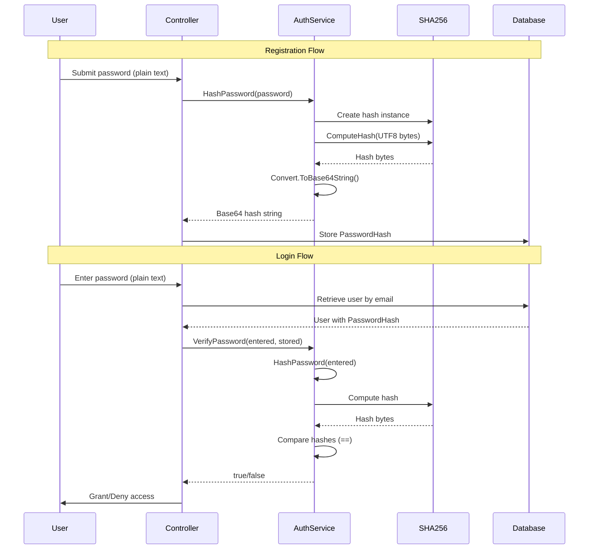
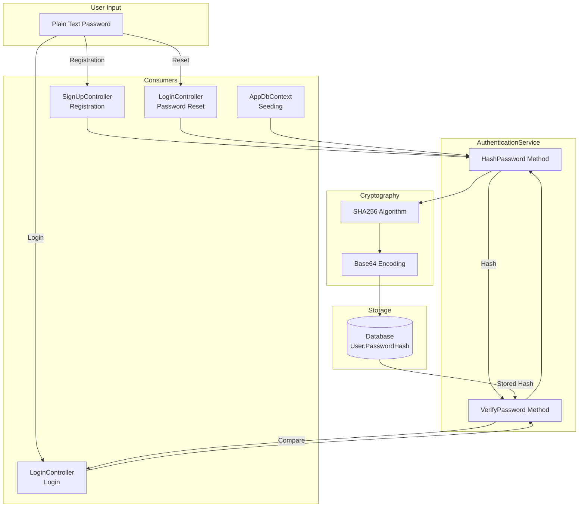
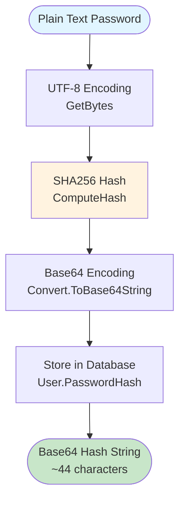
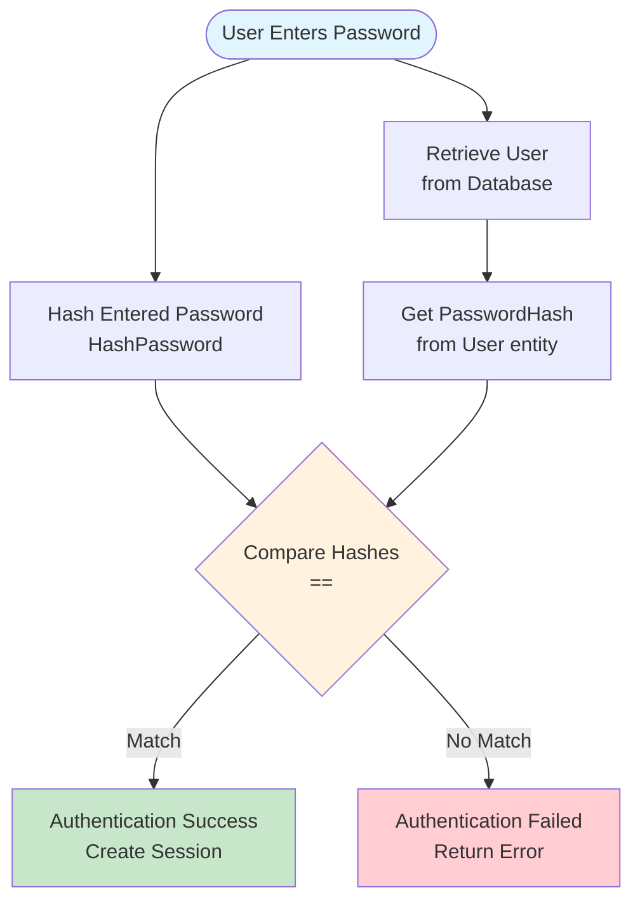

# AuthenticationService - Knowledge Capture

## Overview

The `AuthenticationService` is a static utility class that provides password hashing and verification functionality for the Ticket Booking application. It uses SHA256 hashing to secure user passwords before storage and during authentication.

**Entry Point:** `Services/AuthenticationService.cs` - Static utility class

**Language:** C# (ASP.NET Core 8.0)

**High-Level Behavior:**
1. **Password Hashing:** Converts plain-text passwords to Base64-encoded SHA256 hashes
2. **Password Verification:** Compares entered password hash with stored hash for authentication
3. **Usage:** Integrated into user registration, login, and password reset flows

**⚠️ Security Warning:** This implementation uses SHA256 without salt, which is **not recommended** for password hashing. SHA256 is fast and vulnerable to rainbow table attacks. Modern applications should use bcrypt, Argon2, or PBKDF2 with salt.

## Implementation Details

### Core Components

#### 1. AuthenticationService Class (`Services/AuthenticationService.cs`)

A static utility class containing two public methods for password management.

```3:19:Services/AuthenticationService.cs
public static class AuthenticationService
{
    public static string HashPassword(string password)
    {
        using (var sha256 = System.Security.Cryptography.SHA256.Create())
        {
            var bytes = System.Text.Encoding.UTF8.GetBytes(password);
            var hash = sha256.ComputeHash(bytes);
            return Convert.ToBase64String(hash);
        }
    }
    public static bool VerifyPassword(string enteredPassword, string storedHashedPassword)
    {
        var hashedEnteredPassword = HashPassword(enteredPassword);
        return hashedEnteredPassword == storedHashedPassword;
    }
}
```

**Key Features:**

1. **HashPassword Method**
   - **Input:** Plain-text password string
   - **Process:**
     - Converts password to UTF-8 byte array
     - Computes SHA256 hash
     - Converts hash bytes to Base64 string
   - **Output:** Base64-encoded SHA256 hash string
   - **Resource Management:** Uses `using` statement to dispose SHA256 instance

2. **VerifyPassword Method**
   - **Input:** 
     - `enteredPassword`: Plain-text password from user input
     - `storedHashedPassword`: Base64-encoded hash from database
   - **Process:**
     - Hashes the entered password using `HashPassword`
     - Performs string comparison with stored hash
   - **Output:** Boolean indicating password match
   - **Security Note:** Uses constant-time comparison (string equality), but SHA256 without salt makes this vulnerable

### Usage Patterns

#### 1. User Registration (`SignUpController.cs`)

Password is hashed when creating a new user account.

```110:119:Controllers/SignUpController.cs
var user = new User
{
    FullName = userRegister.FullName,
    Email = userRegister.Email,
    PasswordHash = AuthenticationService.HashPassword(userRegister.Password),
    Phone = userRegister.Phone,
    Role = Enums.Role.User,
    CreatedAt = DateTime.Now
};
```

**Flow:**
1. User submits registration form with plain-text password
2. OTP verification completes
3. `HashPassword` converts password to hash
4. Hash stored in `User.PasswordHash` field
5. User entity saved to database

#### 2. User Login (`LoginController.cs`)

Password verification during authentication.

```35:46:Controllers/LoginController.cs
var user = await _userRepository.GetByEmailAsync(userLogin.Email);
if (user == null)
{
    ModelState.AddModelError(string.Empty, "Invalid login attempt.");
    return View();
}

if (AuthenticationService.VerifyPassword(userLogin.Password, user.PasswordHash) == false)
{
    ModelState.AddModelError(string.Empty, "Invalid login attempt.");
    return View();
}
```

**Flow:**
1. User submits login credentials
2. User retrieved from database by email
3. `VerifyPassword` compares entered password with stored hash
4. If match, session created with user data
5. User redirected based on role (User/Admin/Partner)

#### 3. Password Reset (`LoginController.cs`)

Password re-hashing when user resets forgotten password.

```128:143:Controllers/LoginController.cs
[HttpPost]
[Route("Login/ResetPassword")]
public async Task<IActionResult> ResetPassword(string email, string newPassword)
{
    var storedEmail = HttpContext.Session.GetString("Forgot_Email");
    var isVerified = HttpContext.Session.GetString("Forgot_Verified");

    if (storedEmail != email || isVerified != "true")
    {
        return BadRequest("Unauthorized request.");
    }

    var user = await _userRepository.GetByEmailAsync(email);
    if (user != null)
    {
        user.PasswordHash = AuthenticationService.HashPassword(newPassword);
        await _userRepository.UpdateAsync(user);
    }
```

**Flow:**
1. User completes OTP verification for password reset
2. New password submitted
3. `HashPassword` converts new password to hash
4. User's `PasswordHash` updated in database
5. Session cleared

#### 4. Database Seeding (`AppDbContext.cs`)

Default users created with hashed passwords during application startup.

```28:50:Data/AppDbContext.cs
User admin = new User()
{
    FullName = "Admin User",
    Email = "admin@gmail.com",
    PasswordHash = AuthenticationService.HashPassword("123"),
    Role = Role.Admin
};

User parnter = new User()
{
    FullName = "Partner User",
    Email = "partner@gmail.com",
    PasswordHash = AuthenticationService.HashPassword("123"),
    Role = Role.Partner
};

User user = new()
{
    FullName = "Thanh Trung",
    Email = "user@gmail.com",
    PasswordHash = AuthenticationService.HashPassword("123"),
    Role = Role.User
};
```

**Note:** All default users have password `"123"` (hashed). This is for development/testing purposes only.

### Execution Flow



### Data Model Integration

The `User` domain model stores the password hash:

```5:19:Models/DomainModels/User.cs
public class User
{
    public int Id { get; set; }
    public string FullName { get; set; } = string.Empty;
    public string Email { get; set; } = string.Empty;
    public string PasswordHash { get; set; } = string.Empty;
    public string? Phone { get; set; }
    public Role Role { get; set; }
    public DateTime CreatedAt { get; set; } = DateTime.Now;

   
    public ICollection<Ticket> Tickets { get; set; } = new List<Ticket>();
    public ICollection<Review> Reviews { get; set; } = new List<Review>();
    public ICollection<Company> Companies { get; set; } = new List<Company>();
}
```

**Database Schema:**
- `PasswordHash` column: `VARCHAR(255)` (Base64 string ~44 characters)
- Indexed via email (unique constraint)
- Required field (non-nullable)

## Dependencies

### Direct Dependencies

1. **System.Security.Cryptography.SHA256** (.NET Framework)
   - Cryptographic hash algorithm
   - Used for password hashing
   - **Note:** Not recommended for password hashing (too fast, no salt)

2. **System.Text.Encoding.UTF8** (.NET Framework)
   - Character encoding for password string conversion
   - Converts password string to byte array

3. **System.Convert** (.NET Framework)
   - Base64 encoding utility
   - Converts hash bytes to Base64 string representation

### Dependency Graph (Depth 3)

```
AuthenticationService
├── System.Security.Cryptography.SHA256 (depth 1)
│   └── System.Security.Cryptography.HashAlgorithm (depth 2)
│       └── System.IDisposable (depth 3)
├── System.Text.Encoding.UTF8 (depth 1)
│   └── System.Text.Encoding (depth 2)
│       └── System.Text.EncoderFallback (depth 3)
└── System.Convert (depth 1)
    └── System (depth 2)
        └── System.Object (depth 3)

Consumers:
├── SignUpController (depth 1)
│   └── IRepository<User> (depth 2)
│       └── UserRepository (depth 3)
├── LoginController (depth 1)
│   └── IRepository<User> (depth 2)
│       └── UserRepository (depth 3)
└── AppDbContext (depth 1)
    └── DbContext (depth 2)
        └── Microsoft.EntityFrameworkCore (depth 3)
```

### Files Touched

**Core Implementation:**
- `Services/AuthenticationService.cs` - Main service class

**Consumers:**
- `Controllers/SignUpController.cs` - User registration (line 115)
- `Controllers/LoginController.cs` - Login (line 42) and password reset (line 141)
- `Data/AppDbContext.cs` - Database seeding (lines 32, 40, 48)

**Data Models:**
- `Models/DomainModels/User.cs` - Contains `PasswordHash` property

**Binding Models:**
- `Models/BindingModels/UserLogin.cs` - Contains plain-text `Password`
- `Models/BindingModels/UserRegister.cs` - Contains plain-text `Password` and `ConfirmPassword`
- `Models/BindingModels/UserOtp.cs` - Contains plain-text `Password` (for password reset)

### External Systems

- **None** - Pure .NET implementation, no external APIs or services

### Generated Code

- **None** - All code is manually written

## Visual Diagrams

### Architecture Overview



### Password Hashing Flow



### Password Verification Flow



## Additional Insights

### Security Considerations

#### ⚠️ Critical Security Issues

1. **SHA256 Without Salt**
   - **Problem:** SHA256 is a fast cryptographic hash, not designed for passwords
   - **Vulnerabilities:**
     - Susceptible to rainbow table attacks
     - Same passwords produce same hashes (no uniqueness)
     - Fast computation enables brute-force attacks
   - **Impact:** High - Passwords can be cracked relatively easily
   - **Recommendation:** Migrate to bcrypt, Argon2, or PBKDF2 with salt

2. **No Salt Implementation**
   - **Problem:** All users with same password have identical hashes
   - **Vulnerabilities:**
     - Rainbow table attacks
     - Hash comparison reveals duplicate passwords
   - **Impact:** High - Weakens password security significantly
   - **Recommendation:** Generate unique salt per password

3. **Constant-Time Comparison**
   - **Current:** Uses string equality (`==`) which may be vulnerable to timing attacks
   - **Impact:** Medium - Potential information leakage
   - **Recommendation:** Use `CryptographicOperations.FixedTimeEquals` for comparison

#### Security Best Practices (Not Currently Implemented)

1. **Use Password Hashing Algorithms Designed for Passwords**
   - **bcrypt:** Industry standard, built-in salt, configurable cost factor
   - **Argon2:** Winner of Password Hashing Competition, memory-hard
   - **PBKDF2:** NIST recommended, configurable iterations

2. **Salt Generation**
   - Generate unique random salt per password
   - Store salt alongside hash (or embed in hash format)
   - Use cryptographically secure random number generator

3. **Work Factor Configuration**
   - Adjustable cost factor (iterations, memory)
   - Balance security vs. performance
   - Increase over time as hardware improves

### Performance Considerations

1. **SHA256 Speed**
   - **Current:** Very fast (~nanoseconds per hash)
   - **Problem:** Enables rapid brute-force attacks
   - **Impact:** Negative - Too fast for password security

2. **Hash Computation**
   - Single SHA256 operation per password
   - No iteration overhead
   - Minimal CPU usage

3. **Storage Efficiency**
   - Base64 encoding: ~44 characters for 32-byte hash
   - Database column: `VARCHAR(255)` (sufficient)
   - Minimal storage overhead

### Error Handling

**Current Implementation:**
- **No explicit error handling** in `AuthenticationService`
- Relies on .NET framework exceptions:
  - `ArgumentNullException` if password is null (implicit)
  - `ObjectDisposedException` if SHA256 disposed incorrectly (prevented by `using`)

**Potential Issues:**
- Null password input not explicitly validated
- Empty string passwords allowed (hashed to empty hash)
- No validation of hash format before comparison

**Recommendations:**
- Add input validation (null checks, minimum length)
- Validate hash format before comparison
- Add logging for authentication failures (security monitoring)

### Current Implementation Status

**✅ Implemented:**
- Basic password hashing functionality
- Password verification logic
- Integration with registration, login, and password reset
- Database seeding support

**⚠️ Security Concerns:**
- SHA256 without salt (not suitable for passwords)
- No password strength requirements
- No rate limiting on authentication attempts
- No account lockout mechanism

**❌ Missing Features:**
- Salt generation and storage
- Password strength validation
- Secure password comparison (timing attack protection)
- Password history tracking
- Account lockout after failed attempts

### Potential Improvements

#### 1. Migrate to bcrypt (Recommended)

```csharp
using BCrypt.Net;

public static class AuthenticationService
{
    public static string HashPassword(string password)
    {
        if (string.IsNullOrWhiteSpace(password))
            throw new ArgumentException("Password cannot be null or empty", nameof(password));
        
        return BCrypt.Net.BCrypt.HashPassword(password, workFactor: 12);
    }
    
    public static bool VerifyPassword(string enteredPassword, string storedHashedPassword)
    {
        if (string.IsNullOrWhiteSpace(enteredPassword) || string.IsNullOrWhiteSpace(storedHashedPassword))
            return false;
        
        try
        {
            return BCrypt.Net.BCrypt.Verify(enteredPassword, storedHashedPassword);
        }
        catch
        {
            return false;
        }
    }
}
```

**Benefits:**
- Built-in salt generation
- Configurable work factor
- Industry standard
- Timing attack resistant

#### 2. Add Password Strength Validation

```csharp
public static bool IsPasswordStrong(string password)
{
    if (string.IsNullOrWhiteSpace(password) || password.Length < 8)
        return false;
    
    bool hasUpper = password.Any(char.IsUpper);
    bool hasLower = password.Any(char.IsLower);
    bool hasDigit = password.Any(char.IsDigit);
    bool hasSpecial = password.Any(ch => !char.IsLetterOrDigit(ch));
    
    return hasUpper && hasLower && hasDigit && hasSpecial;
}
```

#### 3. Add Secure Comparison

```csharp
using System.Security.Cryptography;

public static bool VerifyPassword(string enteredPassword, string storedHashedPassword)
{
    var hashedEnteredPassword = HashPassword(enteredPassword);
    
    // Use constant-time comparison to prevent timing attacks
    return CryptographicOperations.FixedTimeEquals(
        Encoding.UTF8.GetBytes(hashedEnteredPassword),
        Encoding.UTF8.GetBytes(storedHashedPassword)
    );
}
```

#### 4. Add Input Validation

```csharp
public static string HashPassword(string password)
{
    if (password == null)
        throw new ArgumentNullException(nameof(password));
    
    if (string.IsNullOrWhiteSpace(password))
        throw new ArgumentException("Password cannot be empty or whitespace", nameof(password));
    
    if (password.Length < 8)
        throw new ArgumentException("Password must be at least 8 characters", nameof(password));
    
    // ... hashing logic
}
```

### Migration Strategy

If migrating from SHA256 to bcrypt:

1. **Dual Support Phase**
   - Support both SHA256 and bcrypt verification
   - Hash new passwords with bcrypt
   - Verify old passwords with SHA256, new with bcrypt
   - Re-hash on successful login

2. **Migration Script**
   - Identify all SHA256 hashes
   - Prompt users to reset passwords (or re-hash on next login)
   - Gradually migrate to bcrypt

3. **Testing**
   - Test password verification with both algorithms
   - Ensure backward compatibility during migration
   - Verify new registrations use bcrypt

## Metadata

- **Analysis Date:** 2025-01-27
- **Entry Point:** `Services/AuthenticationService.cs` - Static utility class
- **Analysis Depth:** 3 levels of dependencies
- **Files Analyzed:** 8+ files
- **Dependencies Traced:** 10+ types/interfaces
- **Security Assessment:** ⚠️ **Critical Issues Identified**
- **Related Documentation:**
  - Consider creating security documentation for password management
  - Review OWASP password storage guidelines

## Next Steps

### Immediate Actions

1. ✅ Knowledge document created
2. ⚠️ **Security Review Required** - SHA256 is not suitable for password hashing
3. Plan migration to secure password hashing algorithm

### Recommended Follow-Ups

1. **Security Migration (High Priority)**
   - Evaluate bcrypt vs. Argon2 vs. PBKDF2
   - Implement secure password hashing
   - Plan migration strategy for existing passwords
   - Add password strength requirements

2. **Enhance Authentication**
   - Add rate limiting for login attempts
   - Implement account lockout mechanism
   - Add password history tracking
   - Consider multi-factor authentication (MFA)

3. **Testing**
   - Add unit tests for `HashPassword` and `VerifyPassword`
   - Test edge cases (null, empty, very long passwords)
   - Add integration tests for authentication flows
   - Security testing (timing attacks, hash collisions)

4. **Documentation**
   - Document password requirements
   - Create security guidelines
   - Document migration plan
   - Update developer documentation

### Questions for Investigation

1. Are there any password policies or requirements?
2. Should we implement password expiration?
3. Do we need password history (prevent reuse)?
4. Should we add account lockout after failed attempts?
5. Is multi-factor authentication (MFA) planned?
6. Are there compliance requirements (PCI-DSS, GDPR) affecting password storage?

### Related Knowledge Captures

Consider capturing knowledge for:
- `LoginController.cs` - Complete authentication flow
- `SignUpController.cs` - User registration process
- `UserRepository.cs` - User data access patterns
- Session management (how user sessions are created/maintained)

---

**⚠️ Security Warning:** This implementation uses SHA256 without salt for password hashing, which is **not secure** for production use. Consider migrating to bcrypt, Argon2, or PBKDF2 with salt before deploying to production.

**Note:** This knowledge document should be updated when security improvements are implemented.


