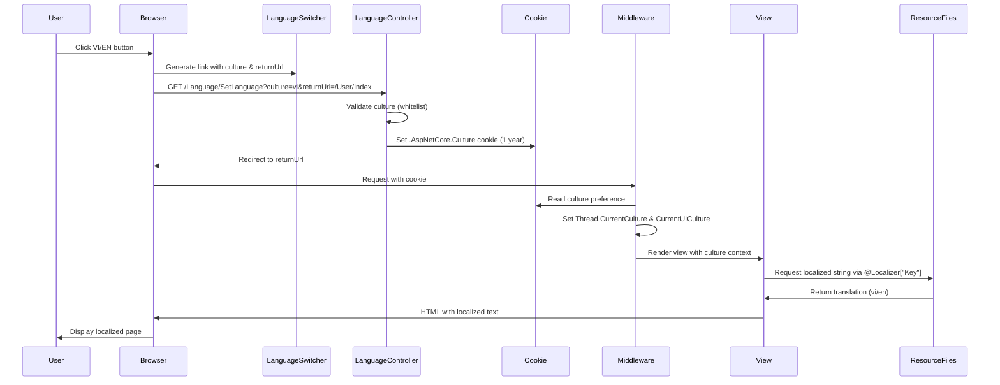
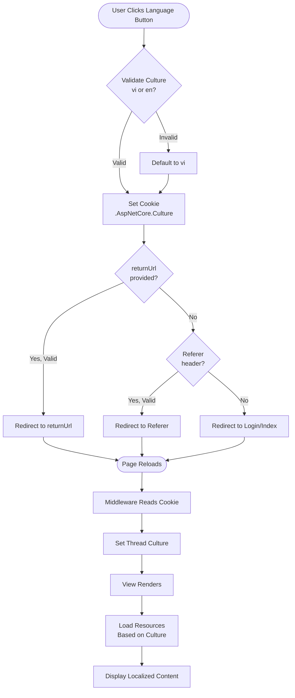
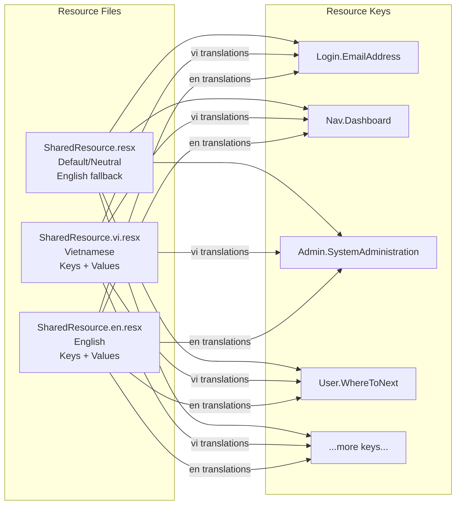

# Language Switching - Knowledge Capture

## Overview

The language switching feature enables users to toggle between Vietnamese (`vi`) and English (`en`) languages throughout the Ticket Booking application. The implementation uses ASP.NET Core's built-in localization framework with cookie-based culture persistence.

**Entry Point:** `Controllers/LanguageController.cs` - `SetLanguage` action method

**Language:** C# (ASP.NET Core 8.0 MVC)

**High-Level Behavior:**
1. User clicks language switcher (VI/EN buttons)
2. Request routed to `LanguageController.SetLanguage` with culture parameter
3. Controller validates culture, sets cookie with 1-year expiration
4. User redirected back to current page (or fallback)
5. Middleware reads cookie on subsequent requests
6. Views render localized strings from resource files

## Implementation Details

### Core Components

#### 1. LanguageController (`Controllers/LanguageController.cs`)

The primary entry point for language switching requests.

```10:45:Controllers/LanguageController.cs
public IActionResult SetLanguage(string culture, string returnUrl)
{
    // Validate culture parameter (whitelist approach)
    var supportedCultures = new[] { "vi", "en" };
    if (!supportedCultures.Contains(culture))
    {
        culture = "vi"; // Default to Vietnamese if invalid
    }

    // Set cookie with culture preference
    Response.Cookies.Append(
        CookieRequestCultureProvider.DefaultCookieName,
        CookieRequestCultureProvider.MakeCookieValue(new RequestCulture(culture)),
        new CookieOptions
        {
            Expires = DateTimeOffset.UtcNow.AddYears(1),
            IsEssential = true,
            SameSite = SameSiteMode.Lax
        }
    );

    // Safe redirect - prevent open redirect attacks
    if (!string.IsNullOrEmpty(returnUrl) && Url.IsLocalUrl(returnUrl))
    {
        return LocalRedirect(returnUrl);
    }

    // Fallback to referrer or home page
    var referer = Request.Headers["Referer"].ToString();
    if (!string.IsNullOrEmpty(referer) && Url.IsLocalUrl(referer))
    {
        return LocalRedirect(referer);
    }

    return RedirectToAction("Index", "Login");
}
```

**Key Features:**
- **Security:** Whitelist validation prevents culture injection attacks
- **Cookie Management:** Uses `CookieRequestCultureProvider.DefaultCookieName` (`.AspNetCore.Culture`)
- **Cookie Options:** 1-year expiration, `IsEssential=true`, `SameSite=Lax` for CSRF protection
- **Safe Redirects:** Validates `returnUrl` and `Referer` using `Url.IsLocalUrl()` to prevent open redirect vulnerabilities
- **Fallback Chain:** returnUrl → Referer → Login/Index

#### 2. Localization Configuration (`Program.cs`)

The application startup configuration sets up localization services and middleware.

```20:71:Program.cs
builder.Services.AddLocalization(options => 
{
    options.ResourcesPath = "Resources";
});
builder.Services.AddControllersWithViews()
    .AddViewLocalization(Microsoft.AspNetCore.Mvc.Razor.LanguageViewLocationExpanderFormat.Suffix)
    .AddDataAnnotationsLocalization(options =>
    {
        options.DataAnnotationLocalizerProvider = (type, factory) =>
            factory.Create(typeof(SharedResource));
    });

// ... other services ...

// Configure localization
var supportedCultures = new[] { "vi", "en" };
builder.Services.Configure<RequestLocalizationOptions>(options =>
{
    options.DefaultRequestCulture = new RequestCulture("vi");
    options.SupportedCultures = supportedCultures.Select(c => new CultureInfo(c)).ToList();
    options.SupportedUICultures = supportedCultures.Select(c => new CultureInfo(c)).ToList();
    
    // Add cookie provider to read culture from cookie
    options.RequestCultureProviders.Insert(0, new CookieRequestCultureProvider());
});

// ... middleware pipeline ...

// Add localization middleware
app.UseRequestLocalization();
```

**Configuration Details:**
- **Resources Path:** `Resources` folder contains `.resx` files
- **View Localization:** Supports culture-specific views (e.g., `Index.vi.cshtml`)
- **Data Annotations:** Validation messages use `SharedResource` for localization
- **Default Culture:** Vietnamese (`vi`) is the default
- **Cookie Provider:** Inserted at position 0 (highest priority) to read culture from cookie
- **Middleware Position:** `UseRequestLocalization()` must be called before routing/authorization

#### 3. SharedResource Marker Class (`SharedResource.cs`)

A marker class that serves as the type parameter for `IStringLocalizer<SharedResource>`.

```1:11:SharedResource.cs
namespace Ticket_Booking
{
    /// <summary>
    /// Marker class for shared localization resources.
    /// This class must be outside the Resources folder to avoid namespace conflicts.
    /// </summary>
    public class SharedResource
    {
        // This is a marker class only - actual resources are in Resources/Resources.resx files
    }
}
```

**Purpose:**
- Provides type-safe access to resource files
- Must be outside `Resources` folder to avoid namespace conflicts
- Actual translations stored in `Resources/SharedResource.{culture}.resx` files

#### 4. Resource Files (`Resources/`)

XML-based resource files containing translations for each culture.

**File Structure:**
- `SharedResource.resx` - Default/neutral resources (English fallback)
- `SharedResource.vi.resx` - Vietnamese translations
- `SharedResource.en.resx` - English translations

**Resource Key Naming Convention:**
- Hierarchical naming with dot notation: `{Area}.{Key}`
- Examples: `Login.EmailAddress`, `Nav.Dashboard`, `Admin.SystemAdministration`
- Grouped by functional area (Login, Nav, Admin, User, SignUp, Common)

**Usage in Views:**
```4:4:Views/_ViewImports.cshtml
@inject IStringLocalizer<SharedResource> Localizer
```

Views access localized strings via:
```csharp
@Localizer["Login.EmailAddress"]
@Localizer["Nav.Dashboard"]
```

#### 5. Language Switcher Component (`Views/Shared/_LanguageSwitcher.cshtml`)

A reusable partial view that displays language selection buttons.

```1:24:Views/Shared/_LanguageSwitcher.cshtml
@using Microsoft.AspNetCore.Localization
@{
    var requestCulture = Context.Features.Get<IRequestCultureFeature>();
    var currentCulture = requestCulture?.RequestCulture?.UICulture?.Name ?? "vi";
    var returnUrl = Context.Request.Path + Context.Request.QueryString;
}

<div class="flex items-center gap-2">
    <a asp-controller="Language" 
       asp-action="SetLanguage" 
       asp-route-culture="vi" 
       asp-route-returnUrl="@returnUrl"
       class="px-3 py-1.5 rounded-lg text-sm font-medium transition-all @(currentCulture.StartsWith("vi") ? "bg-indigo-800 text-white" : "text-indigo-200 hover:bg-indigo-800 hover:text-white")">
        VI
    </a>
    <span class="text-indigo-400">|</span>
    <a asp-controller="Language" 
       asp-action="SetLanguage" 
       asp-route-culture="en" 
       asp-route-returnUrl="@returnUrl"
       class="px-3 py-1.5 rounded-lg text-sm font-medium transition-all @(currentCulture.StartsWith("en") ? "bg-indigo-800 text-white" : "text-indigo-200 hover:bg-indigo-800 hover:text-white")">
        EN
    </a>
</div>
```

**Features:**
- Reads current culture from `IRequestCultureFeature`
- Preserves current URL and query string as `returnUrl`
- Visual indicator highlights active language
- Styled with Tailwind CSS (indigo theme)

**Integration:**
The language switcher is included in `_Layout.cshtml` for both authenticated and anonymous users:
```77:77:Views/Shared/_Layout.cshtml
@await Html.PartialAsync("_LanguageSwitcher")
```

### Execution Flow



### Key Patterns

1. **Cookie-Based Persistence**
   - Culture preference stored in HTTP cookie
   - Survives browser sessions (1-year expiration)
   - No database required
   - Works for anonymous users

2. **Middleware-Based Culture Resolution**
   - `UseRequestLocalization()` middleware runs early in pipeline
   - Reads cookie before views render
   - Sets `Thread.CurrentCulture` and `Thread.CurrentUICulture`
   - Available via `IRequestCultureFeature` in views

3. **Type-Safe Resource Access**
   - `IStringLocalizer<SharedResource>` provides IntelliSense support
   - Compile-time checking of resource key existence (via tooling)
   - Fallback to key name if translation missing

4. **Security-First Approach**
   - Whitelist validation for culture parameter
   - Safe redirect validation prevents open redirect attacks
   - Cookie security attributes (SameSite, HttpOnly consideration)

## Dependencies

### Direct Dependencies

1. **Microsoft.AspNetCore.Localization** (Built-in)
   - `IStringLocalizer<T>`
   - `RequestLocalizationOptions`
   - `CookieRequestCultureProvider`
   - `IRequestCultureFeature`

2. **Microsoft.AspNetCore.Mvc** (Built-in)
   - Controller base class
   - `LocalRedirect()` helper
   - `Url.IsLocalUrl()` validation

3. **System.Globalization** (Built-in)
   - `CultureInfo` for culture representation

### Dependency Graph (Depth 3)

```
LanguageController
├── Microsoft.AspNetCore.Mvc.Controller (depth 1)
│   └── Microsoft.AspNetCore.Mvc.ControllerBase (depth 2)
│       └── Microsoft.AspNetCore.Mvc.Filters.IFilterMetadata (depth 3)
├── Microsoft.AspNetCore.Http.HttpContext (depth 1)
│   └── Microsoft.AspNetCore.Http.Features.IFeatureCollection (depth 2)
│       └── System.Collections.Generic.IEnumerable (depth 3)
├── CookieRequestCultureProvider (depth 1)
│   └── RequestCultureProvider (depth 2)
│       └── Microsoft.AspNetCore.Localization.IRequestCultureProvider (depth 3)
└── RequestCulture (depth 1)
    └── CultureInfo (depth 2)
        └── System.Globalization (depth 3)

Views/_LanguageSwitcher.cshtml
├── IRequestCultureFeature (depth 1)
│   └── RequestCulture (depth 2)
│       └── CultureInfo (depth 3)
└── IStringLocalizer<SharedResource> (via _ViewImports) (depth 1)
    └── ResourceManager (depth 2)
        └── System.Resources (depth 3)

Program.cs (Localization Config)
├── AddLocalization() (depth 1)
│   └── LocalizationServiceCollectionExtensions (depth 2)
│       └── IServiceCollection (depth 3)
├── AddViewLocalization() (depth 1)
│   └── MvcLocalizationMvcBuilderExtensions (depth 2)
│       └── IMvcBuilder (depth 3)
└── UseRequestLocalization() (depth 1)
    └── RequestLocalizationMiddleware (depth 2)
        └── Microsoft.AspNetCore.Http.IMiddleware (depth 3)
```

### Files Touched

**Core Implementation:**
- `Controllers/LanguageController.cs` - Main controller
- `Program.cs` - Service and middleware configuration
- `SharedResource.cs` - Marker class
- `Resources/SharedResource.resx` - Default resources
- `Resources/SharedResource.vi.resx` - Vietnamese translations
- `Resources/SharedResource.en.resx` - English translations
- `Views/Shared/_LanguageSwitcher.cshtml` - UI component
- `Views/_ViewImports.cshtml` - Localizer injection

**Integration Points:**
- `Views/Shared/_Layout.cshtml` - Includes language switcher (2 locations)
- All views using `@Localizer["Key"]` - Currently: Login, SignUp, User, Admin views

### External Systems

- **None** - Pure ASP.NET Core implementation, no external APIs or services

### Generated Code

- `Resources/SharedResource.Designer.cs` - Auto-generated resource accessor class
- `Resources/Resources.Designer.cs` - Auto-generated (if Resources.resx exists)

## Visual Diagrams

### Architecture Overview

```mermaid
graph TB
    subgraph "User Interface"
        LS[Language Switcher<br/>VI | EN]
    end
    
    subgraph "Controllers"
        LC[LanguageController<br/>SetLanguage Action]
    end
    
    subgraph "Storage"
        Cookie[HTTP Cookie<br/>.AspNetCore.Culture<br/>Expires: 1 year]
    end
    
    subgraph "Middleware Pipeline"
        LM[RequestLocalization<br/>Middleware]
    end
    
    subgraph "Resource Files"
        RS[SharedResource.resx<br/>Default/Neutral]
        RV[SharedResource.vi.resx<br/>Vietnamese]
        RE[SharedResource.en.resx<br/>English]
    end
    
    subgraph "Views"
        V1[Login/Index.cshtml]
        V2[User/Index.cshtml]
        V3[Admin/Index.cshtml]
        VN[Other Views...]
    end
    
    LS -->|Click VI/EN| LC
    LC -->|Set Cookie| Cookie
    LC -->|Redirect| V1
    Cookie -->|Read on Request| LM
    LM -->|Set Culture| V1
    LM -->|Set Culture| V2
    LM -->|Set Culture| V3
    LM -->|Set Culture| VN
    V1 -->|@Localizer["Key"]| RS
    V1 -->|@Localizer["Key"]| RV
    V1 -->|@Localizer["Key"]| RE
    V2 -->|@Localizer["Key"]| RS
    V2 -->|@Localizer["Key"]| RV
    V2 -->|@Localizer["Key"]| RE
    V3 -->|@Localizer["Key"]| RS
    V3 -->|@Localizer["Key"]| RV
    V3 -->|@Localizer["Key"]| RE
    VN -->|@Localizer["Key"]| RS
    VN -->|@Localizer["Key"]| RV
    VN -->|@Localizer["Key"]| RE
```

### Request Flow



### Resource File Structure



## Additional Insights

### Security Considerations

1. **Culture Parameter Validation**
   - Whitelist approach prevents injection attacks
   - Only `"vi"` and `"en"` are accepted
   - Invalid values default to `"vi"`

2. **Open Redirect Prevention**
   - `Url.IsLocalUrl()` validates redirect URLs
   - Prevents redirects to external malicious sites
   - Fallback chain: returnUrl → Referer → Login/Index

3. **Cookie Security**
   - `SameSite=Lax` provides CSRF protection
   - `IsEssential=true` ensures cookie works with GDPR consent
   - 1-year expiration balances persistence and privacy

### Performance Considerations

1. **Resource File Compilation**
   - `.resx` files compiled into assemblies at build time
   - No runtime file I/O for resource lookups
   - Fast in-memory access via `ResourceManager`

2. **Cookie Overhead**
   - Minimal cookie size (~50 bytes)
   - Sent with every request (acceptable for culture preference)
   - No database queries required

3. **Middleware Impact**
   - Runs early in pipeline (before routing)
   - Minimal overhead (cookie read + culture set)
   - No blocking I/O operations

### Error Handling

1. **Missing Translations**
   - Falls back to resource key name (default `IStringLocalizer` behavior)
   - Example: If `Login.EmailAddress` missing, displays `"Login.EmailAddress"`
   - Consider logging missing keys in development

2. **Invalid Culture**
   - Defaults to Vietnamese (`"vi"`)
   - No exception thrown, graceful degradation

3. **Cookie Disabled**
   - Falls back to default culture (`"vi"`)
   - No error, but language preference not persisted
   - Consider session storage as alternative

### Current Implementation Status

**✅ Fully Implemented:**
- Core infrastructure (controller, middleware, resources)
- Language switcher UI component
- Cookie-based persistence
- Security validations

**⚠️ Partially Implemented:**
- View localization coverage (only some views use `@Localizer`)
- Resource key coverage (keys exist for many areas, but not all views updated)

**📊 Usage Statistics:**
- Views using localization: ~10+ views (Login, SignUp, User, Admin areas)
- Resource keys: 100+ keys across multiple areas
- Supported cultures: 2 (Vietnamese, English)

### Potential Improvements

1. **Session Fallback**
   - Add session storage as fallback if cookies disabled
   - Store culture in `HttpContext.Session`

2. **User Preference Storage**
   - Store language preference in user profile (database)
   - Sync cookie with user account on login

3. **Browser Language Detection**
   - Add `AcceptLanguageHeaderRequestCultureProvider` as fallback
   - Detect browser language preference automatically

4. **Missing Key Logging**
   - Log missing resource keys in development
   - Help identify untranslated strings

5. **Culture-Specific Views**
   - Support `Index.vi.cshtml` and `Index.en.cshtml` for complete view localization
   - Currently only using resource files for strings

## Metadata

- **Analysis Date:** 2025-01-27
- **Entry Point:** `Controllers/LanguageController.cs` → `SetLanguage` method
- **Analysis Depth:** 3 levels of dependencies
- **Files Analyzed:** 15+ files
- **Dependencies Traced:** 20+ types/interfaces
- **Related Documentation:**
  - `docs/ai/design/language-switching.md` - Architecture design
  - `docs/ai/implementation/language-switching.md` - Implementation guide
  - `docs/ai/implementation/language-switching-review.md` - Code review
  - `docs/ai/testing/language-switching.md` - Testing strategy

## Next Steps

### Immediate Actions
1. ✅ Knowledge document created
2. Review existing implementation against this knowledge base
3. Identify any gaps or inconsistencies

### Recommended Follow-Ups
1. **Complete View Localization**
   - Audit all views for hardcoded strings
   - Replace with `@Localizer["Key"]` calls
   - Add missing resource keys

2. **Enhance Testing**
   - Add integration tests for language switching
   - Test cookie persistence across sessions
   - Verify security validations

3. **Documentation Updates**
   - Update design docs if implementation deviates
   - Document resource key naming conventions
   - Create developer guide for adding new translations

4. **Related Knowledge Captures**
   - Consider capturing knowledge for:
     - `AuthenticationService.cs` (user session management)
     - `_Layout.cshtml` (shared UI components)
     - Resource file management workflow

### Questions for Investigation
1. Are there any views that should NOT be localized?
2. Should we support more languages in the future?
3. Do we need culture-specific date/number formatting?
4. Should language preference sync with user account?

---

**Note:** This knowledge document should be updated when significant changes are made to the language switching implementation.


