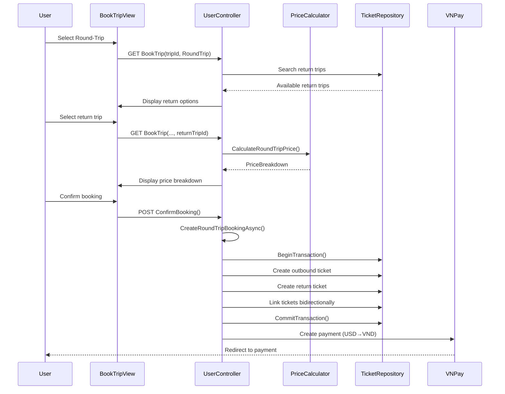
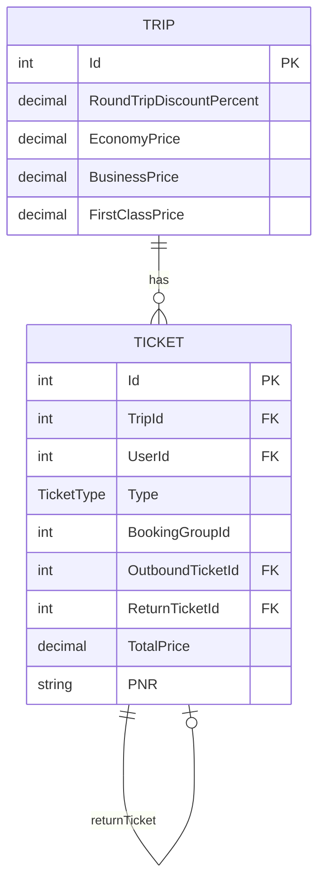
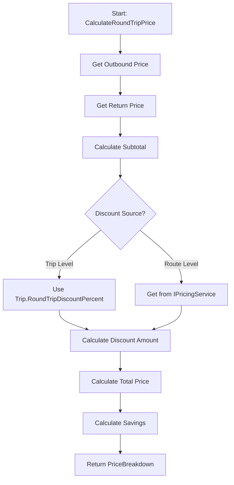

# Round-Trip Booking Knowledge

## Overview

Round-trip booking is a feature that allows users to book both outbound and return flights together, receiving a discount compared to booking two separate one-way tickets. The system creates two linked tickets (outbound and return) with a shared booking group ID, applies route-specific discounts, and handles payment as a single transaction.

**Language:** C# (ASP.NET Core MVC)  
**Primary Entry Points:**
- `UserController.BookTrip()` (GET) - Display booking form with return flight selection
- `UserController.ConfirmBooking()` (POST) - Process booking request
- `UserController.CreateRoundTripBookingAsync()` - Core booking creation logic

**Key Behavior:**
- Users select an outbound trip, then choose a return trip from available options
- System calculates price with discount applied (0-50% based on route configuration)
- Creates two linked tickets with unique PNRs but shared booking group
- Single payment transaction covers both tickets
- Tickets are displayed together in user's booking history

## Implementation Details

### Core Logic Flow

1. **Trip Selection (GET BookTrip)**
   - User selects outbound trip
   - If round-trip mode: System searches for return trips (reverse route, same company, after outbound arrival)
   - Filters to trips with available seats
   - Limits to 20 return options, ordered by departure time

2. **Price Calculation**
   - Uses `PriceCalculatorService.CalculateRoundTripPrice()`
   - Calculates: OutboundPrice + ReturnPrice = Subtotal
   - Applies discount: `discountAmount = subtotal * (discountPercent / 100)`
   - Final: `totalPrice = subtotal - discountAmount`
   - Savings = discount amount (compared to two one-way tickets)

3. **Booking Creation (CreateRoundTripBookingAsync)**
   - Validates both trips exist and return is after outbound
   - Checks seat availability for both trips
   - Generates unique booking group ID (timestamp-based)
   - Creates two separate PNRs (one per ticket)
   - Uses database transaction for atomicity
   - Creates outbound and return tickets with bidirectional linking
   - Decreases seat availability for both trips
   - Converts total price from USD to VND for VNPay payment
   - Redirects to payment gateway

### Key Components

#### 1. Ticket Model Extensions
```csharp
public class Ticket
{
    public TicketType Type { get; set; } = TicketType.OneWay;
    public int? OutboundTicketId { get; set; }  // Links return → outbound
    public int? ReturnTicketId { get; set; }     // Links outbound → return
    public int? BookingGroupId { get; set; }     // Groups tickets together
    // Navigation properties
    public Ticket? OutboundTicket { get; set; }
    public Ticket? ReturnTicket { get; set; }
}
```

#### 2. Trip Model - Discount Configuration
```csharp
public class Trip
{
    public decimal RoundTripDiscountPercent { get; set; } = 0;  // 0-50%
    public DateTime? PriceLastUpdated { get; set; }
}
```

#### 3. Price Calculation Service
- **Interface:** `IPriceCalculatorService`
- **Implementation:** `PriceCalculatorService`
- **Method:** `CalculateRoundTripPrice(outboundTrip, returnTrip, seatClass)`
- **Returns:** `RoundTripPriceBreakdown` with detailed pricing

#### 4. Booking ViewModel
```csharp
public class BookingViewModel
{
    public TicketType TicketType { get; set; }
    public Trip? OutboundTrip { get; set; }
    public Trip? ReturnTrip { get; set; }
    public int? ReturnTripId { get; set; }
    public IEnumerable<Trip>? AvailableReturnTrips { get; set; }
    public RoundTripPriceBreakdown? PriceBreakdown { get; set; }
}
```

### Validation Rules

1. **Return Trip Validation:**
   - Must exist in database
   - Must be from same company as outbound
   - Must depart after outbound arrival: `returnTrip.DepartureTime > outboundTrip.ArrivalTime`
   - Must have available seats for selected class

2. **Discount Validation:**
   - Discount percentage: 0-50% (enforced by `IPricingService.ValidateDiscount()`)
   - Applied to subtotal (outbound + return prices)
   - Can be set per-trip or per-route (via `IPricingService`)

3. **Seat Availability:**
   - Both trips must have available seats for selected class
   - Checked before booking creation
   - Seats decreased atomically in transaction

### Error Handling

- **Trip Not Found:** Redirects to booking page with error message
- **Invalid Return Time:** Validates return departs after outbound arrival
- **No Available Seats:** Checks both trips before creating tickets
- **PNR Generation Failure:** Catches `InvalidOperationException`, shows error
- **Payment Creation Failure:** Transaction automatically rolls back
- **Transaction Failure:** All changes rolled back, error message displayed

### Payment Processing

- **Currency Conversion:** USD (database) → VND (VNPay) via `ICurrencyService`
- **Single Payment:** One payment transaction covers both tickets
- **Payment Description:** Includes both cities and outbound PNR
- **Primary Ticket:** Outbound ticket ID stored for payment callback

## Dependencies

### Direct Dependencies (Depth 1)
- `IRepository<Trip>` - Trip data access
- `IRepository<Ticket>` - Ticket data access
- `IPriceCalculatorService` - Price calculation logic
- `IPNRHelper` - PNR code generation
- `ICurrencyService` - USD to VND conversion
- `IVnpayClient` - Payment gateway integration
- `TripRepository` - Advanced trip search and transaction support

### Indirect Dependencies (Depth 2)
- `IPricingService` - Discount management and validation
- `TicketRepository` - Transaction support and user-specific queries
- `BookingViewModel` - View model for booking form
- `RoundTripPriceBreakdown` - Price calculation result model

### External Systems
- **VNPay Payment Gateway** - Payment processing
- **SQLite Database** - Data persistence
- **Exchange Rate API** - Currency conversion (via CurrencyService)

## Visual Diagrams

### Round-Trip Booking Flow



### Ticket Linking Structure



### Price Calculation Logic



## Additional Insights

### Design Decisions

1. **Separate PNRs per Ticket:**
   - Each ticket (outbound/return) has its own 6-character PNR
   - Allows independent tracking and check-in
   - Booking group ID links them together

2. **Bidirectional Linking:**
   - Both `OutboundTicketId` and `ReturnTicketId` are set
   - Enables navigation from either ticket to its pair
   - Simplifies queries and display logic

3. **Booking Group ID:**
   - Timestamp-based unique ID: `DateTime.UtcNow.Ticks % int.MaxValue`
   - Groups tickets for display in user's booking history
   - Only outbound ticket shown, with return info accessible

4. **Transaction Atomicity:**
   - All database operations wrapped in transaction
   - Ensures both tickets created or neither
   - Seat availability decreased atomically
   - Automatic rollback on any failure

5. **Price Storage:**
   - Individual ticket prices stored (outbound price, return price)
   - Total price calculated at booking time
   - Discount applied to combined subtotal
   - Each ticket stores its leg's price for historical accuracy

### Performance Considerations

- **Return Trip Search:** Limited to 20 results to prevent UI overload
- **Transaction Scope:** Minimal - only ticket creation and seat updates
- **Price Calculation:** Synchronous, fast (no external calls)
- **Currency Conversion:** Async, cached via `ICurrencyService`

### Security Considerations

- **User Authentication:** Session-based, checked before booking
- **Authorization:** Users can only book for themselves
- **Input Validation:** All trip IDs and parameters validated
- **Transaction Safety:** Database transactions prevent partial bookings

### Potential Improvements

1. **Different Seat Classes per Leg:**
   - Interface supports it (`CalculateRoundTripPrice` with separate classes)
   - UI currently only allows same class for both legs
   - Could add UI option for mixed-class bookings

2. **Flexible Return Dates:**
   - Currently shows fixed return options
   - Could add date range picker for more flexibility

3. **Discount Tiers:**
   - Currently single discount percentage
   - Could implement tiered discounts (e.g., 5% for 1-7 days, 10% for 8-14 days)

4. **Booking Modifications:**
   - No current support for changing return flight after booking
   - Could add modification feature with price difference calculation

5. **Partial Cancellation:**
   - Currently no support for canceling one leg of round-trip
   - Could add feature with refund calculation

## Metadata

- **Analysis Date:** 2024-12-20
- **Analysis Depth:** 3 levels
- **Files Analyzed:**
  - `Controllers/UserController.cs` (BookTrip, ConfirmBooking, CreateRoundTripBookingAsync)
  - `Services/PriceCalculatorService.cs`
  - `Interfaces/IPriceCalculatorService.cs`
  - `Interfaces/IPricingService.cs`
  - `Models/ViewModels/BookingViewModel.cs`
  - `Models/DomainModels/Ticket.cs`
  - `Models/DomainModels/Trip.cs`
  - `Views/User/BookTrip.cshtml`

- **Key Patterns:**
  - Transaction-based atomic operations
  - Bidirectional entity linking
  - Service-based price calculation
  - ViewModel pattern for complex forms

- **Related Areas:**
  - Payment processing (`UserController.PaySuccess`)
  - Ticket display (`UserController.MyBookings`)
  - Check-in process (`CheckInController`)
  - Partner pricing management (`PartnerController`)

## Next Steps

1. **Testing:**
   - Test booking with various discount percentages
   - Test error scenarios (no return trips, unavailable seats)
   - Test payment flow and callback handling
   - Test ticket display in MyBookings

2. **Documentation:**
   - Consider adding API documentation for booking endpoints
   - Document discount configuration for partners

3. **Monitoring:**
   - Track round-trip booking conversion rates
   - Monitor discount usage and effectiveness
   - Track payment success rates for round-trip bookings

